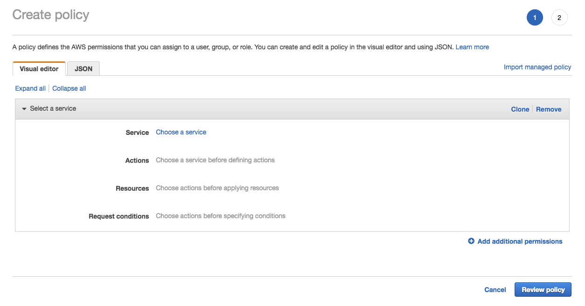
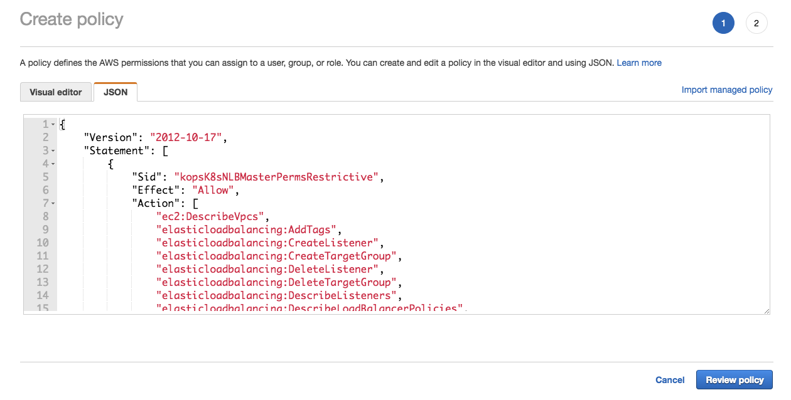
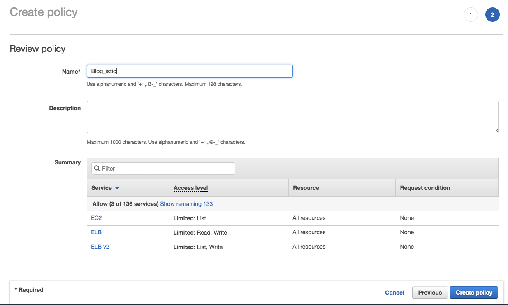
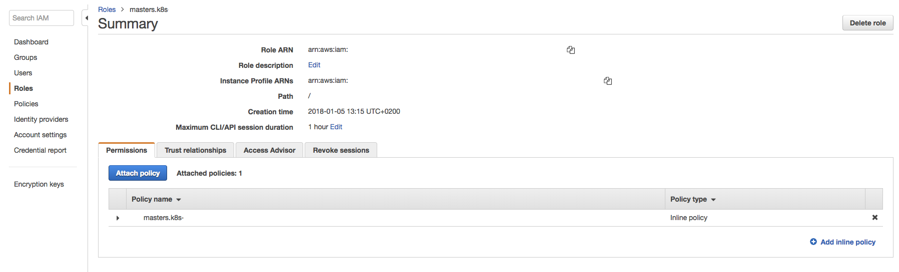

aws-nlb
================================================

.. note::

   This post was updated on January 16, 2019 to include some
usage warnings.

This post provides instructions to use and configure ingress Istio with
`AWS Network Load
Balancer <https://docs.aws.amazon.com/elasticloadbalancing/latest/network/introduction.html>`_.

Network load balancer (NLB) could be used instead of classical load
balancer. You can see the
`comparison <https://aws.amazon.com/elasticloadbalancing/details/#Product_comparisons>`_
between different AWS ``loadbalancer`` for more explanation.

Prerequisites
-------------

The following instructions require a Kubernetes **1.9.0 or newer**
cluster.

.. warning::

   Usage of AWS ``nlb`` on Kubernetes is an Alpha feature
and not recommended for production clusters.

Usage of AWS ``nlb`` does not support the creation of two or more
Kubernetes clusters running Istio in the same zone as a result of
`Kubernetes Bug
#69264 <https://github.com/kubernetes/kubernetes/issues/69264>`_. 

IAM policy
----------

You need to apply policy on the master role in order to be able to
provision network load balancer.

1. In AWS ``iam`` console click on policies and click on create a new
   one:

2. Select ``json``:

3. Copy/paste text below:

    { “Version”: “2012-10-17”, “Statement”: [ { “Sid”:
   “kopsK8sNLBMasterPermsRestrictive”, “Effect”: “Allow”, “Action”: [
   “ec2:DescribeVpcs”, “elasticloadbalancing:AddTags”,
   “elasticloadbalancing:CreateListener”,
   “elasticloadbalancing:CreateTargetGroup”,
   “elasticloadbalancing:DeleteListener”,
   “elasticloadbalancing:DeleteTargetGroup”,
   “elasticloadbalancing:DescribeListeners”,
   “elasticloadbalancing:DescribeLoadBalancerPolicies”,
   “elasticloadbalancing:DescribeTargetGroups”,
   “elasticloadbalancing:DescribeTargetHealth”,
   “elasticloadbalancing:ModifyListener”,
   “elasticloadbalancing:ModifyTargetGroup”,
   “elasticloadbalancing:RegisterTargets”,
   “elasticloadbalancing:SetLoadBalancerPoliciesOfListener” ],
   “Resource”: [ "*" ] }, { “Effect”: “Allow”, “Action”: [
   “ec2:DescribeVpcs”, “ec2:DescribeRegions” ], “Resource”: "*" } ] }

4. Click review policy, fill all fields and click create policy:

5. Click on roles, select you master role nodes, and click attach
   policy:

6. Your policy is now attach to your master node.

Generate the Istio manifest
---------------------------

To use an AWS ``nlb`` load balancer, it is necessary to add an AWS
specific annotation to the Istio installation. These instructions
explain how to add the annotation.

Save this as the file ``override.yaml``:

.. code:: yaml

    gateways: istio-ingressgateway: serviceAnnotations:
service.beta.kubernetes.io/aws-load-balancer-type: “nlb”

Generate a manifest with Helm:

.. code:: sh

      $ helm template install/kubernetes/helm/istio
–namespace istio -f override.yaml > $HOME/istio.yaml
