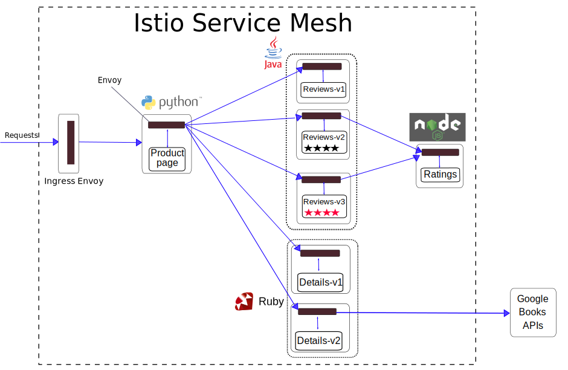

egress-https
================================================

In many cases, not all the parts of a microservices-based application
reside in a *service mesh*. Sometimes, the microservices-based
applications use functionality provided by legacy systems that reside
outside the mesh. You may want to migrate these systems to the service
mesh gradually. Until these systems are migrated, they must be accessed
by the applications inside the mesh. In other cases, the applications
use web services provided by third parties.

In this blog post, I modify the `Istio Bookinfo Sample
Application </docs/examples/bookinfo/>`_ to fetch book details from an
external web service (`Google Books
APIs <https://developers.google.com/books/docs/v1/getting_started>`_).
I show how to enable egress HTTPS traffic in Istio by using
*mesh-external service entries*. I provide two options for egress HTTPS
traffic and describe the pros and cons of each of the options.

Initial setting
---------------

To demonstrate the scenario of consuming an external web service, I
start with a Kubernetes cluster with `Istio
installed </docs/setup/getting-started/>`_. Then I deploy `Istio
Bookinfo Sample Application </docs/examples/bookinfo/>`_. This
application uses the *details* microservice to fetch book details, such
as the number of pages and the publisher. The original *details*
microservice provides the book details without consulting any external
service.

The example commands in this blog post work with Istio 1.0+, with or
without `mutual
TLS </docs/concepts/security/#mutual-tls-authentication>`_ enabled. The
Bookinfo configuration files reside in the ``samples/bookinfo``
directory of the Istio release archive.

Here is a copy of the end-to-end architecture of the application from
the original `Bookinfo sample application </docs/examples/bookinfo/>`_.

.. image:: /docs/examples/bookinfo/withistio.svg
   :alt: The Original Bookinfo Application
   :width: 80%

Perform the steps in the `Deploying the
application </docs/examples/bookinfo/#deploying-the-application>`_,
`Confirm the app is
running </docs/examples/bookinfo/#confirm-the-app-is-accessible-from-outside-the-cluster>`_,
`Apply default destination
rules </docs/examples/bookinfo/#apply-default-destination-rules>`_
sections, and `change Istio to the blocking-egress-by-default
policy </docs/tasks/traffic-management/egress/egress-control/#change-to-the-blocking-by-default-policy>`_.

Bookinfo with HTTPS access to a Google Books web service
--------------------------------------------------------

Deploy a new version of the *details* microservice, *v2*, that fetches
the book details from `Google Books
APIs <https://developers.google.com/books/docs/v1/getting_started>`_.
Run the following command; it sets the ``DO_NOT_ENCRYPT`` environment
variable of the service’s container to ``false``. This setting will
instruct the deployed service to use HTTPS (instead of HTTP) to access
to the external service.

.. code:: sh

      $ kubectl apply -f
@samples/bookinfo/platform/kube/bookinfo-details-v2.yaml@ –dry-run -o
yaml \| kubectl set env –local -f - ‘DO_NOT_ENCRYPT=false’ -o yaml \|
kubectl apply -f -

The updated architecture of the application now looks as follows:



Note that the Google Books web service is outside the Istio service
mesh, the boundary of which is marked by a dashed line.

Now direct all the traffic destined to the *details* microservice, to
*details version v2*.

.. code:: sh

      $ kubectl apply -f
@samples/bookinfo/networking/virtual-service-details-v2.yaml@ 

Note that the virtual service relies on a destination rule that you
created in the `Apply default destination
rules </docs/examples/bookinfo/#apply-default-destination-rules>`_
section.

Access the web page of the application, after `determining the ingress
IP and
port </docs/examples/bookinfo/#determine-the-ingress-ip-and-port>`_.

Oops… Instead of the book details you have the *Error fetching product
details* message displayed:

.. image:: ./errorFetchingBookDetails.png
   :alt: The Error Fetching Product Details Message
   :width: 80%

The good news is that your application did not crash. With a good
microservice design, you do not have **failure propagation**. In your
case, the failing *details* microservice does not cause the
``productpage`` microservice to fail. Most of the functionality of the
application is still provided, despite the failure in the *details*
microservice. You have **graceful service degradation**: as you can see,
the reviews and the ratings are displayed correctly, and the application
is still useful.

So what might have gone wrong? Ah… The answer is that I forgot to tell
you to enable traffic from inside the mesh to an external service, in
this case to the Google Books web service. By default, the Istio sidecar
proxies (`Envoy proxies <https://www.envoyproxy.io>`_) **block all the
traffic to destinations outside the cluster**. To enable such traffic,
you must define a `mesh-external service
entry </docs/reference/config/networking/service-entry/>`_.

Enable HTTPS access to a Google Books web service
~~~~~~~~~~~~~~~~~~~~~~~~~~~~~~~~~~~~~~~~~~~~~~~~~

No worries, define a **mesh-external service entry** and fix your
application. You must also define a *virtual service* to perform routing
by `SNI <https://en.wikipedia.org/wiki/Server_Name_Indication>`_ to the
external service.

.. code:: sh

      $ kubectl apply -f - <<EOF apiVersion:
networking.istio.io/v1alpha3 kind: ServiceEntry metadata: name:
googleapis spec: hosts: - www.googleapis.com ports: - number: 443 name:
https protocol: HTTPS location: MESH_EXTERNAL resolution: DNS —
apiVersion: networking.istio.io/v1alpha3 kind: VirtualService metadata:
name: googleapis spec: hosts: - www.googleapis.com tls: - match: - port:
443 sni_hosts: - www.googleapis.com route: - destination: host:
www.googleapis.com port: number: 443 weight: 100 EOF

Now accessing the web page of the application displays the book details
without error:

.. image:: ./externalBookDetails.png
   :alt: Book Details Displayed Correctly
   :width: 80%

You can query your service entries:

.. code:: sh

      $ kubectl get serviceentries NAME AGE googleapis 8m


You can delete your service entry:

.. code:: sh

      $ kubectl delete serviceentry googleapis serviceentry
“googleapis” deleted

and see in the output that the service entry is deleted.

Accessing the web page after deleting the service entry produces the
same error that you experienced before, namely *Error fetching product
details*. As you can see, the service entries are defined
**dynamically**, as are many other Istio configuration artifacts. The
Istio operators can decide dynamically which domains they allow the
microservices to access. They can enable and disable traffic to the
external domains on the fly, without redeploying the microservices.

Cleanup of HTTPS access to a Google Books web service
~~~~~~~~~~~~~~~~~~~~~~~~~~~~~~~~~~~~~~~~~~~~~~~~~~~~~

.. code:: sh

      $ kubectl delete serviceentry googleapis $ kubectl
delete virtualservice googleapis $ kubectl delete -f
@samples/bookinfo/networking/virtual-service-details-v2.yaml@ $ kubectl
delete -f @samples/bookinfo/platform/kube/bookinfo-details-v2.yaml@

TLS origination by Istio
------------------------

There is a caveat to this story. Suppose you want to monitor which
specific set of `Google
APIs <https://developers.google.com/apis-explorer/>`_ your
microservices use
(`Books <https://developers.google.com/books/docs/v1/getting_started>`_,
`Calendar <https://developers.google.com/calendar/>`_,
`Tasks <https://developers.google.com/tasks/>`_ etc.) Suppose you want
to enforce a policy that using only `Books
APIs <https://developers.google.com/books/docs/v1/getting_started>`_ is
allowed. Suppose you want to monitor the book identifiers that your
microservices access. For these monitoring and policy tasks you need to
know the URL path. Consider for example the URL
```www.googleapis.com/books/v1/volumes?q=isbn:0486424618`` <https://www.googleapis.com/books/v1/volumes?q=isbn:0486424618>`_.
In that URL, `Books
APIs <https://developers.google.com/books/docs/v1/getting_started>`_ is
specified by the path segment ``/books``, and the
`ISBN <https://en.wikipedia.org/wiki/International_Standard_Book_Number>`_
number by the path segment ``/volumes?q=isbn:0486424618``. However, in
HTTPS, all the HTTP details (hostname, path, headers etc.) are encrypted
and such monitoring and policy enforcement by the sidecar proxies is not
possible. Istio can only know the server name of the encrypted requests
by the `SNI <https://tools.ietf.org/html/rfc3546#section-3.1>`_
(*Server Name Indication*) field, in this case ``www.googleapis.com``.

To allow Istio to perform monitoring and policy enforcement of egress
requests based on HTTP details, the microservices must issue HTTP
requests. Istio then opens an HTTPS connection to the destination
(performs TLS origination). The code of the microservices must be
written differently or configured differently, according to whether the
microservice runs inside or outside an Istio service mesh. This
contradicts the Istio design goal of `maximizing
transparency </docs/ops/deployment/architecture/#design-goals>`_.
Sometimes you need to compromise…

The diagram below shows two options for sending HTTPS traffic to
external services. On the top, a microservice sends regular HTTPS
requests, encrypted end-to-end. On the bottom, the same microservice
sends unencrypted HTTP requests inside a pod, which are intercepted by
the sidecar Envoy proxy. The sidecar proxy performs TLS origination, so
the traffic between the pod and the external service is encrypted.

.. image:: ./https_from_the_app.svg
   :alt:
   :caption: HTTPS traffic to external services, with TLS originated by the microservice vs. by the sidecar proxy
   :width: 60%

Here is how both patterns are supported in the `Bookinfo details
microservice
code <%7B%7B%3C%20github_file%20%3E%7D%7D/samples/bookinfo/src/details/details.rb>`_,
using the Ruby `net/http
module <https://docs.ruby-lang.org/en/2.0.0/Net/HTTP.html>`_:

 uri =
URI.parse(‘https://www.googleapis.com/books/v1/volumes?q=isbn:’ + isbn)
http = Net::HTTP.new(uri.host, ENV[‘DO_NOT_ENCRYPT’] === ‘true’ ?
80:443) … unless ENV[‘DO_NOT_ENCRYPT’] === ‘true’ then http.use_ssl =
true end

When the ``DO_NOT_ENCRYPT`` environment variable is defined, the request
is performed without SSL (plain HTTP) to port 80.

You can set the ``DO_NOT_ENCRYPT`` environment variable to *“true”* in
the `Kubernetes deployment spec of details
v2 <%7B%7B%3C%20github_file%20%3E%7D%7D/samples/bookinfo/platform/kube/bookinfo-details-v2.yaml>`_,
the ``container`` section:

.. code:: yaml

    env: - name: DO_NOT_ENCRYPT value: “true” 

In the next section you will configure TLS origination for accessing an
external web service.

Bookinfo with TLS origination to a Google Books web service
-----------------------------------------------------------

1. Deploy a version of *details v2* that sends an HTTP request to
   `Google Books
   APIs <https://developers.google.com/books/docs/v1/getting_started>`_.
   The ``DO_NOT_ENCRYPT`` variable is set to true in
   `bookinfo-details-v2.yaml <%7B%7B%3C%20github_file%20%3E%7D%7D/samples/bookinfo/platform/kube/bookinfo-details-v2.yaml>`_.

   .. code:: sh

      $ kubectl apply -f
   @samples/bookinfo/platform/kube/bookinfo-details-v2.yaml@ 

2. Direct the traffic destined to the *details* microservice, to
   *details version v2*.

   .. code:: sh

      $ kubectl apply -f
   @samples/bookinfo/networking/virtual-service-details-v2.yaml@

3. Create a mesh-external service entry for ``www.google.apis`` , a
   virtual service to rewrite the destination port from 80 to 443, and a
   destination rule to perform TLS origination.

   .. code:: sh

      $ kubectl apply -f - <<EOF apiVersion:
   networking.istio.io/v1alpha3 kind: ServiceEntry metadata: name:
   googleapis spec: hosts:

   -  www.googleapis.com ports:
   -  number: 80 name: http protocol: HTTP
   -  number: 443 name: https protocol: HTTPS resolution: DNS —
      apiVersion: networking.istio.io/v1alpha3 kind: VirtualService
      metadata: name: rewrite-port-for-googleapis spec: hosts:
   -  www.googleapis.com http:
   -  match:

      -  port: 80 route:
      -  destination: host: www.googleapis.com port: number: 443 —
         apiVersion: networking.istio.io/v1alpha3 kind: DestinationRule
         metadata: name: originate-tls-for-googleapis spec: host:
         www.googleapis.com trafficPolicy: loadBalancer: simple:
         ROUND_ROBIN portLevelSettings:
      -  port: number: 443 tls: mode: SIMPLE # initiates HTTPS when
         accessing www.googleapis.com EOF

4. Access the web page of the application and verify that the book
   details are displayed without errors.

5. `Enable Envoy’s access
   logging </docs/tasks/observability/logs/access-log/#enable-envoy-s-access-logging>`_

6. Check the log of of the sidecar proxy of *details v2* and see the
   HTTP request.

   .. code:: sh

      $ kubectl logs $(kubectl get pods -l app=details -l
   version=v2 -o jsonpath=‘{.items[0].metadata.name}’) istio-proxy \|
   grep googleapis [2018-08-09T11:32:58.171Z] “GET
   /books/v1/volumes?q=isbn:0486424618 HTTP/1.1” 200 - 0 1050 264 264
   “-” “Ruby” “b993bae7-4288-9241-81a5-4cde93b2e3a6”
   “www.googleapis.com:80” “172.217.20.74:80” EOF

   Note the URL path in the log, the path can be monitored and access
   policies can be applied based on it. To read more about monitoring
   and access policies for HTTP egress traffic, check out `this blog
   post <https://archive.istio.io/v0.8/blog/2018/egress-monitoring-access-control/#logging>`_.

Cleanup of TLS origination to a Google Books web service
~~~~~~~~~~~~~~~~~~~~~~~~~~~~~~~~~~~~~~~~~~~~~~~~~~~~~~~~

.. code:: sh

      $ kubectl delete serviceentry googleapis $ kubectl
delete virtualservice rewrite-port-for-googleapis $ kubectl delete
destinationrule originate-tls-for-googleapis $ kubectl delete -f
@samples/bookinfo/networking/virtual-service-details-v2.yaml@ $ kubectl
delete -f @samples/bookinfo/platform/kube/bookinfo-details-v2.yaml@

Relation to Istio mutual TLS
~~~~~~~~~~~~~~~~~~~~~~~~~~~~

Note that the TLS origination in this case is unrelated to `the mutual
TLS </docs/concepts/security/#mutual-tls-authentication>`_ applied by
Istio. The TLS origination for the external services will work, whether
the Istio mutual TLS is enabled or not. The **mutual** TLS secures
service-to-service communication **inside** the service mesh and
provides each service with a strong identity. The **external services**
in this blog post were accessed using **one-way TLS**, the same
mechanism used to secure communication between a web browser and a web
server. TLS is applied to the communication with external services to
verify the identity of the external server and to encrypt the traffic.

Conclusion
----------

In this blog post I demonstrated how microservices in an Istio service
mesh can consume external web services by HTTPS. By default, Istio
blocks all the traffic to the hosts outside the cluster. To enable such
traffic, mesh-external service entries must be created for the service
mesh. It is possible to access the external sites either by issuing
HTTPS requests, or by issuing HTTP requests with Istio performing TLS
origination. When the microservices issue HTTPS requests, the traffic is
encrypted end-to-end, however Istio cannot monitor HTTP details like the
URL paths of the requests. When the microservices issue HTTP requests,
Istio can monitor the HTTP details of the requests and enforce
HTTP-based access policies. However, in that case the traffic between
microservice and the sidecar proxy is unencrypted. Having part of the
traffic unencrypted can be forbidden in organizations with very strict
security requirements.
