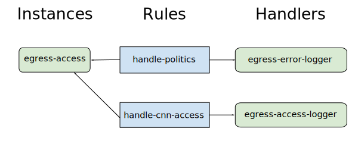
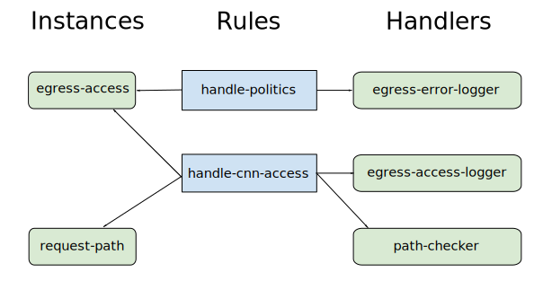
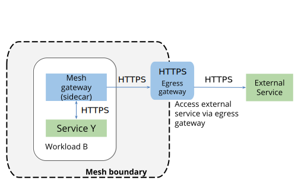

egress-monitoring-access-control
================================================

While Istio’s main focus is management of traffic between microservices
inside a service mesh, Istio can also manage ingress (from outside into
the mesh) and egress (from the mesh outwards) traffic. Istio can
uniformly enforce access policies and aggregate telemetry data for
mesh-internal, ingress and egress traffic.

In this blog post, we show how to apply monitoring and access policies
to HTTP egress traffic with Istio.

Use case
--------

Consider an organization that runs applications that process content
from *cnn.com*. The applications are decomposed into microservices
deployed in an Istio service mesh. The applications access pages of
various topics from *cnn.com*:
`edition.cnn.com/politics <https://edition.cnn.com/politics>`_,
`edition.cnn.com/sport <https://edition.cnn.com/sport>`_ and
`edition.cnn.com/health <https://edition.cnn.com/health>`_. The
organization `configures Istio to allow access to
edition.cnn.com </docs/tasks/traffic-management/egress/egress-gateway-tls-origination/>`_
and everything works fine. However, at some point in time, the
organization decides to banish politics. Practically, it means blocking
access to
`edition.cnn.com/politics <https://edition.cnn.com/politics>`_ and
allowing access to
`edition.cnn.com/sport <https://edition.cnn.com/sport>`_ and
`edition.cnn.com/health <https://edition.cnn.com/health>`_ only. The
organization will grant permissions to individual applications and to
particular users to access
`edition.cnn.com/politics <https://edition.cnn.com/politics>`_, on a
case-by-case basis.

To achieve that goal, the organization’s operations people monitor
access to the external services and analyze Istio logs to verify that no
unauthorized request was sent to
`edition.cnn.com/politics <https://edition.cnn.com/politics>`_. They
also configure Istio to prevent access to
`edition.cnn.com/politics <https://edition.cnn.com/politics>`_
automatically.

The organization is resolved to prevent any tampering with the new
policy. It decides to put mechanisms in place that will prevent any
possibility for a malicious application to access the forbidden topic.

Related tasks and examples
--------------------------

-  The `Control Egress
   Traffic </docs/tasks/traffic-management/egress/>`_ task demonstrates
   how external (outside the Kubernetes cluster) HTTP and HTTPS services
   can be accessed by applications inside the mesh.
-  The `Configure an Egress
   Gateway </docs/tasks/traffic-management/egress/egress-gateway/>`_
   example describes how to configure Istio to direct egress traffic
   through a dedicated gateway service called *egress gateway*.
-  The `Egress Gateway with TLS
   Origination </docs/tasks/traffic-management/egress/egress-gateway-tls-origination/>`_
   example demonstrates how to allow applications to send HTTP requests
   to external servers that require HTTPS, while directing traffic
   through egress gateway.
-  The `Collecting
   Metrics </docs/tasks/observability/mixer/metrics/collecting-metrics/>`_
   task describes how to configure metrics for services in a mesh.
-  The `Visualizing Metrics with
   Grafana </docs/tasks/observability/metrics/using-istio-dashboard/>`_
   describes the Istio Dashboard to monitor mesh traffic.
-  The `Basic Access
   Control </docs/tasks/policy-enforcement/denial-and-list/>`_ task
   shows how to control access to in-mesh services.
-  The `Denials and White/Black
   Listing </docs/tasks/policy-enforcement/denial-and-list/>`_ task
   shows how to configure access policies using black or white list
   checkers.

As opposed to the observability and security tasks above, this blog post
describes Istio’s monitoring and access policies applied exclusively to
the egress traffic.

Before you begin
----------------

Follow the steps in the `Egress Gateway with TLS
Origination </docs/tasks/traffic-management/egress/egress-gateway-tls-origination/>`_
example, **with mutual TLS authentication enabled**, without the
`Cleanup </docs/tasks/traffic-management/egress/egress-gateway-tls-origination//#cleanup>`_
step. After completing that example, you can access
`edition.cnn.com/politics <https://edition.cnn.com/politics>`_ from an
in-mesh container with ``curl`` installed. This blog post assumes that
the ``SOURCE_POD`` environment variable contains the source pod’s name
and that the container’s name is ``sleep``.

Configure monitoring and access policies
----------------------------------------

Since you want to accomplish your tasks in a *secure way*, you should
direct egress traffic through *egress gateway*, as described in the
`Egress Gateway with TLS
Origination </docs/tasks/traffic-management/egress/egress-gateway-tls-origination/>`_
task. The *secure way* here means that you want to prevent malicious
applications from bypassing Istio monitoring and policy enforcement.

According to our scenario, the organization performed the instructions
in the `Before you begin <#before-you-begin>`_ section, enabled HTTP
traffic to *edition.cnn.com*, and configured that traffic to pass
through the egress gateway. The egress gateway performs TLS origination
to *edition.cnn.com*, so the traffic leaves the mesh encrypted. At this
point, the organization is ready to configure Istio to monitor and apply
access policies for the traffic to *edition.cnn.com*.

Logging
~~~~~~~

Configure Istio to log access to \_*.cnn.com_. You create a ``logentry``
and two
`stdio </docs/reference/config/policy-and-telemetry/adapters/stdio/>`_
``handlers``, one for logging forbidden access (*error* log level) and
another one for logging all access to \_*.cnn.com\_ (*info* log level).
Then you create ``rules`` to direct your ``logentry`` instances to your
``handlers``. One rule directs access to \_*.cnn.com/politics\_ to the
handler for logging forbidden access, another rule directs log entries
to the handler that outputs each access to \_*.cnn.com\_ as an *info*
log entry. To understand the Istio ``logentries``, ``rules``, and
``handlers``, see `Istio Adapter Model </blog/2017/adapter-model/>`_. A
diagram with the involved entities and dependencies between them appears
below:

1. Create the ``logentry``, ``rules`` and ``handlers``. Note that you
   specify ``context.reporter.uid`` as
   ``kubernetes://istio-egressgateway`` in the rules to get logs from
   the egress gateway only.

   .. code:: sh

      $ cat <<EOF \| kubectl apply -f - # Log entry for
   egress access apiVersion: “config.istio.io/v1alpha2” kind: logentry
   metadata: name: egress-access namespace: istio-system spec: severity:
   ‘“info”’ timestamp: request.time variables: destination: request.host
   \| “unknown” path: request.path \| “unknown” responseCode:
   response.code \| 0 responseSize: response.size \| 0 reporterUID:
   context.reporter.uid \| “unknown” sourcePrincipal: source.principal
   \| “unknown” monitored_resource_type: ‘“UNSPECIFIED”’ — # Handler for
   error egress access entries apiVersion: “config.istio.io/v1alpha2”
   kind: stdio metadata: name: egress-error-logger namespace:
   istio-system spec: severity_levels: info: 2 # output log level as
   error outputAsJson: true — # Rule to handle access to
   \*.cnn.com/politics apiVersion: “config.istio.io/v1alpha2” kind: rule
   metadata: name: handle-politics namespace: istio-system spec: match:
   request.host.endsWith(“cnn.com”) &&
   request.path.startsWith(“/politics”) &&
   context.reporter.uid.startsWith(“kubernetes://istio-egressgateway”)
   actions:

   -  handler: egress-error-logger.stdio instances:

      -  .. rubric:: egress-access.logentry
            :name: egress-access.logentry

         .. rubric:: Handler for info egress access entries
            :name: handler-for-info-egress-access-entries

         apiVersion: “config.istio.io/v1alpha2” kind: stdio metadata:
         name: egress-access-logger namespace: istio-system spec:
         severity_levels: info: 0 # output log level as info
         outputAsJson: true — # Rule to handle access to \*.cnn.com
         apiVersion: “config.istio.io/v1alpha2” kind: rule metadata:
         name: handle-cnn-access namespace: istio-system spec: match:
         request.host.endsWith(“.cnn.com”) &&
         context.reporter.uid.startsWith(“kubernetes://istio-egressgateway”)
         actions:

   -  handler: egress-access-logger.stdio instances:

      -  egress-access.logentry EOF

2. Send three HTTP requests to *cnn.com*, to
   `edition.cnn.com/politics <https://edition.cnn.com/politics>`_,
   `edition.cnn.com/sport <https://edition.cnn.com/sport>`_ and
   `edition.cnn.com/health <https://edition.cnn.com/health>`_. All
   three should return *200 OK*.

   .. code:: sh

      $ kubectl exec -it $SOURCE_POD -c sleep – sh -c
   ‘curl -sL -o /dev/null -w “%{http_code}:raw-latex:`\n`”
   http://edition.cnn.com/politics; curl -sL -o /dev/null -w
   “%{http_code}:raw-latex:`\n`” http://edition.cnn.com/sport; curl -sL
   -o /dev/null -w “%{http_code}:raw-latex:`\n`”
   http://edition.cnn.com/health’ 200 200 200

3. Query the Mixer log and see that the information about the requests
   appears in the log:

   .. code:: sh

      $ kubectl -n istio-system logs -l
   istio-mixer-type=telemetry -c mixer \| grep egress-access \| grep cnn
   \| tail -4
   {“level”:“info”,“time”:“2019-01-29T07:43:24.611462Z”,“instance”:“egress-access.logentry.istio-system”,“destination”:“edition.cnn.com”,“path”:“/politics”,“reporterUID”:“kubernetes://istio-egressgateway-747b6764b8-44rrh.istio-system”,“responseCode”:200,“responseSize”:1883355,“sourcePrincipal”:“cluster.local/ns/default/sa/sleep”}
   {“level”:“info”,“time”:“2019-01-29T07:43:24.886316Z”,“instance”:“egress-access.logentry.istio-system”,“destination”:“edition.cnn.com”,“path”:“/sport”,“reporterUID”:“kubernetes://istio-egressgateway-747b6764b8-44rrh.istio-system”,“responseCode”:200,“responseSize”:2094561,“sourcePrincipal”:“cluster.local/ns/default/sa/sleep”}
   {“level”:“info”,“time”:“2019-01-29T07:43:25.369663Z”,“instance”:“egress-access.logentry.istio-system”,“destination”:“edition.cnn.com”,“path”:“/health”,“reporterUID”:“kubernetes://istio-egressgateway-747b6764b8-44rrh.istio-system”,“responseCode”:200,“responseSize”:2157009,“sourcePrincipal”:“cluster.local/ns/default/sa/sleep”}
   {“level”:“error”,“time”:“2019-01-29T07:43:24.611462Z”,“instance”:“egress-access.logentry.istio-system”,“destination”:“edition.cnn.com”,“path”:“/politics”,“reporterUID”:“kubernetes://istio-egressgateway-747b6764b8-44rrh.istio-system”,“responseCode”:200,“responseSize”:1883355,“sourcePrincipal”:“cluster.local/ns/default/sa/sleep”}

   You see four log entries related to your three requests. Three *info*
   entries about the access to *edition.cnn.com* and one *error* entry
   about the access to *edition.cnn.com/politics*. The service mesh
   operators can see all the access instances, and can also search the
   log for *error* log entries that represent forbidden accesses. This
   is the first security measure the organization can apply before
   blocking the forbidden accesses automatically, namely logging all the
   forbidden access instances as errors. In some settings this can be a
   sufficient security measure.

   Note the attributes:

   -  ``destination``, ``path``, ``responseCode``, ``responseSize`` are
      related to HTTP parameters of the requests
   -  ``sourcePrincipal``:``cluster.local/ns/default/sa/sleep`` - a
      string that represents the ``sleep`` service account in the
      ``default`` namespace
   -  ``reporterUID``:
      ``kubernetes://istio-egressgateway-747b6764b8-44rrh.istio-system``
      - a UID of the reporting pod, in this case
      ``istio-egressgateway-747b6764b8-44rrh`` in the ``istio-system``
      namespace

Access control by routing
~~~~~~~~~~~~~~~~~~~~~~~~~

After enabling logging of access to *edition.cnn.com*, automatically
enforce an access policy, namely allow accessing */health* and */sport*
URL paths only. Such a simple policy control can be implemented with
Istio routing.

1. Redefine your ``VirtualService`` for *edition.cnn.com*:

   .. code:: sh

      $ cat <<EOF \| kubectl apply -f - apiVersion:
   networking.istio.io/v1alpha3 kind: VirtualService metadata: name:
   direct-cnn-through-egress-gateway spec: hosts:

   -  edition.cnn.com gateways:
   -  istio-egressgateway
   -  mesh http:
   -  match:

      -  gateways:

         -  mesh port: 80 route:

      -  destination: host:
         istio-egressgateway.istio-system.svc.cluster.local subset: cnn
         port: number: 443 weight: 100

   -  match:

      -  gateways:

         -  istio-egressgateway port: 443 uri: regex: “/health|/sport”
            route:

      -  destination: host: edition.cnn.com port: number: 443 weight:
         100 EOF

   Note that you added a ``match`` by ``uri`` condition that checks that
   the URL path is either */health* or */sport*. Also note that this
   condition is added to the ``istio-egressgateway`` section of the
   ``VirtualService``, since the egress gateway is a hardened component
   in terms of security (see [egress gateway security considerations]
   (/docs/tasks/traffic-management/egress/egress-gateway/#additional-security-considerations)).
   You don’t want any tampering with your policies.

2. Send the previous three HTTP requests to *cnn.com*:

   .. code:: sh

      $ kubectl exec -it $SOURCE_POD -c sleep – sh -c
   ‘curl -sL -o /dev/null -w “%{http_code}:raw-latex:`\n`”
   http://edition.cnn.com/politics; curl -sL -o /dev/null -w
   “%{http_code}:raw-latex:`\n`” http://edition.cnn.com/sport; curl -sL
   -o /dev/null -w “%{http_code}:raw-latex:`\n`”
   http://edition.cnn.com/health’ 404 200 200

   The request to
   `edition.cnn.com/politics <https://edition.cnn.com/politics>`_
   returned *404 Not Found*, while requests to
   `edition.cnn.com/sport <https://edition.cnn.com/sport>`_ and
   `edition.cnn.com/health <https://edition.cnn.com/health>`_ returned
   *200 OK*, as expected.

   .. note::

   You may need to wait several seconds for the update of
   the ``VirtualService`` to propagate to the egress gateway. 

3. Query the Mixer log and see that the information about the requests
   appears again in the log:

   .. code:: sh

      $ kubectl -n istio-system logs -l
   istio-mixer-type=telemetry -c mixer \| grep egress-access \| grep cnn
   \| tail -4
   {“level”:“info”,“time”:“2019-01-29T07:55:59.686082Z”,“instance”:“egress-access.logentry.istio-system”,“destination”:“edition.cnn.com”,“path”:“/politics”,“reporterUID”:“kubernetes://istio-egressgateway-747b6764b8-44rrh.istio-system”,“responseCode”:404,“responseSize”:0,“sourcePrincipal”:“cluster.local/ns/default/sa/sleep”}
   {“level”:“info”,“time”:“2019-01-29T07:55:59.697565Z”,“instance”:“egress-access.logentry.istio-system”,“destination”:“edition.cnn.com”,“path”:“/sport”,“reporterUID”:“kubernetes://istio-egressgateway-747b6764b8-44rrh.istio-system”,“responseCode”:200,“responseSize”:2094561,“sourcePrincipal”:“cluster.local/ns/default/sa/sleep”}
   {“level”:“info”,“time”:“2019-01-29T07:56:00.264498Z”,“instance”:“egress-access.logentry.istio-system”,“destination”:“edition.cnn.com”,“path”:“/health”,“reporterUID”:“kubernetes://istio-egressgateway-747b6764b8-44rrh.istio-system”,“responseCode”:200,“responseSize”:2157009,“sourcePrincipal”:“cluster.local/ns/default/sa/sleep”}
   {“level”:“error”,“time”:“2019-01-29T07:55:59.686082Z”,“instance”:“egress-access.logentry.istio-system”,“destination”:“edition.cnn.com”,“path”:“/politics”,“reporterUID”:“kubernetes://istio-egressgateway-747b6764b8-44rrh.istio-system”,“responseCode”:404,“responseSize”:0,“sourcePrincipal”:“cluster.local/ns/default/sa/sleep”}

   You still get info and error messages regarding accesses to
   `edition.cnn.com/politics <https://edition.cnn.com/politics>`_,
   however this time the ``responseCode`` is ``404``, as expected.

While implementing access control using Istio routing worked for us in
this simple case, it would not suffice for more complex cases. For
example, the organization may want to allow access to
`edition.cnn.com/politics <https://edition.cnn.com/politics>`_ under
certain conditions, so more complex policy logic than just filtering by
URL paths will be required. You may want to apply `Istio Mixer
Adapters </blog/2017/adapter-model/>`_, for example `white lists or
black
lists </docs/tasks/policy-enforcement/denial-and-list/#attribute-based-whitelists-or-blacklists>`_
of allowed/forbidden URL paths, respectively. `Policy
Rules </docs/reference/config/policy-and-telemetry/istio.policy.v1beta1/>`_
allow specifying complex conditions, specified in a `rich expression
language </docs/reference/config/policy-and-telemetry/expression-language/>`_,
which includes AND and OR logical operators. The rules can be reused for
both logging and policy checks. More advanced users may want to apply
`Istio Role-Based Access
Control </docs/concepts/security/#authorization>`_.

An additional aspect is integration with remote access policy systems.
If the organization in our use case operates some `Identity and Access
Management <https://en.wikipedia.org/wiki/Identity_management>`_
system, you may want to configure Istio to use access policy information
from such a system. You implement this integration by applying `Istio
Mixer Adapters </blog/2017/adapter-model/>`_.

Cancel the access control by routing you used in this section and
implement access control by Mixer policy checks in the next section.

1. Replace the ``VirtualService`` for *edition.cnn.com* with your
   previous version from the `Configure an Egress
   Gateway </docs/tasks/traffic-management/egress/egress-gateway-tls-origination/#perform-tls-origination-with-an-egress-gateway>`_
   example:

   .. code:: sh

      $ cat <<EOF \| kubectl apply -f - apiVersion:
   networking.istio.io/v1alpha3 kind: VirtualService metadata: name:
   direct-cnn-through-egress-gateway spec: hosts:

   -  edition.cnn.com gateways:
   -  istio-egressgateway
   -  mesh http:
   -  match:

      -  gateways:

         -  mesh port: 80 route:

      -  destination: host:
         istio-egressgateway.istio-system.svc.cluster.local subset: cnn
         port: number: 443 weight: 100

   -  match:

      -  gateways:

         -  istio-egressgateway port: 443 route:

      -  destination: host: edition.cnn.com port: number: 443 weight:
         100 EOF

2. Send the previous three HTTP requests to *cnn.com*, this time you
   should get three *200 OK* responses as previously:

   .. code:: sh

      $ kubectl exec -it $SOURCE_POD -c sleep – sh -c
   ‘curl -sL -o /dev/null -w “%{http_code}:raw-latex:`\n`”
   http://edition.cnn.com/politics; curl -sL -o /dev/null -w
   “%{http_code}:raw-latex:`\n`” http://edition.cnn.com/sport; curl -sL
   -o /dev/null -w “%{http_code}:raw-latex:`\n`”
   http://edition.cnn.com/health’ 200 200 200

.. note::

   You may need to wait several seconds for the update of the
``VirtualService`` to propagate to the egress gateway.

Access control by Mixer policy checks
~~~~~~~~~~~~~~~~~~~~~~~~~~~~~~~~~~~~~

In this step you use a Mixer `Listchecker
adapter </docs/reference/config/policy-and-telemetry/adapters/list/>`_,
its whitelist variety. You define a ``listentry`` with the URL path of
the request and a ``listchecker`` to check the ``listentry`` using a
static list of allowed URL paths, specified by the ``overrides`` field.
For an external `Identity and Access
Management <https://en.wikipedia.org/wiki/Identity_management>`_
system, use the ``providerurl`` field instead. The updated diagram of
the instances, rules and handlers appears below. Note that you reuse the
same policy rule, ``handle-cnn-access`` both for logging and for access
policy checks.

1. Define ``path-checker`` and ``request-path``:

   .. code:: sh

      $ cat <<EOF \| kubectl create -f - apiVersion:
   “config.istio.io/v1alpha2” kind: listchecker metadata: name:
   path-checker namespace: istio-system spec: overrides: [“/health”,
   “/sport”] # overrides provide a static list blacklist: false —
   apiVersion: “config.istio.io/v1alpha2” kind: listentry metadata:
   name: request-path namespace: istio-system spec: value: request.path
   EOF

2. Modify the ``handle-cnn-access`` policy rule to send ``request-path``
   instances to the ``path-checker``:

   .. code:: sh

      $ cat <<EOF \| kubectl apply -f - # Rule handle
   egress access to cnn.com apiVersion: “config.istio.io/v1alpha2” kind:
   rule metadata: name: handle-cnn-access namespace: istio-system spec:
   match: request.host.endsWith(“.cnn.com”) &&
   context.reporter.uid.startsWith(“kubernetes://istio-egressgateway”)
   actions:

   -  handler: egress-access-logger.stdio instances:

      -  egress-access.logentry

   -  handler: path-checker.listchecker instances:

      -  request-path.listentry EOF

3. Perform your usual test by sending HTTP requests to
   `edition.cnn.com/politics <https://edition.cnn.com/politics>`_,
   `edition.cnn.com/sport <https://edition.cnn.com/sport>`_ and
   `edition.cnn.com/health <https://edition.cnn.com/health>`_. As
   expected, the request to
   `edition.cnn.com/politics <https://edition.cnn.com/politics>`_
   returns *403* (Forbidden).

   .. code:: sh

      $ kubectl exec -it $SOURCE_POD -c sleep – sh -c
   ‘curl -sL -o /dev/null -w “%{http_code}:raw-latex:`\n`”
   http://edition.cnn.com/politics; curl -sL -o /dev/null -w
   “%{http_code}:raw-latex:`\n`” http://edition.cnn.com/sport; curl -sL
   -o /dev/null -w “%{http_code}:raw-latex:`\n`”
   http://edition.cnn.com/health’ 403 200 200

Access control by Mixer policy checks, part 2
~~~~~~~~~~~~~~~~~~~~~~~~~~~~~~~~~~~~~~~~~~~~~

After the organization in our use case managed to configure logging and
access control, it decided to extend its access policy by allowing the
applications with a special `Service
Account <https://kubernetes.io/docs/tasks/configure-pod-container/configure-service-account/>`_
to access any topic of *cnn.com*, without being monitored. You’ll see
how this requirement can be configured in Istio.

1. Start the
   `sleep <%7B%7B%3C%20github_tree%20%3E%7D%7D/samples/sleep>`_ sample
   with the ``politics`` service account.

   .. code:: sh

      $ sed ‘s/: sleep/: politics/g’
   @samples/sleep/sleep.yaml@ \| kubectl create -f - serviceaccount
   “politics” created service “politics” created deployment “politics”
   created

2. Define the ``SOURCE_POD_POLITICS`` shell variable to hold the name of
   the source pod with the ``politics`` service account, for sending
   requests to external services.

   .. code:: sh

      $ export SOURCE_POD_POLITICS=$(kubectl get pod -l
   app=politics -o jsonpath={.items..metadata.name})

3. Perform your usual test of sending three HTTP requests this time from
   ``SOURCE_POD_POLITICS``. The request to
   `edition.cnn.com/politics <https://edition.cnn.com/politics>`_
   returns *403*, since you did not configure the exception for the
   *politics* namespace.

   .. code:: sh

      $ kubectl exec -it $SOURCE_POD_POLITICS -c politics
   – sh -c ‘curl -sL -o /dev/null -w “%{http_code}:raw-latex:`\n`”
   http://edition.cnn.com/politics; curl -sL -o /dev/null -w
   “%{http_code}:raw-latex:`\n`” http://edition.cnn.com/sport; curl -sL
   -o /dev/null -w “%{http_code}:raw-latex:`\n`”
   http://edition.cnn.com/health’ 403 200 200

4. Query the Mixer log and see that the information about the requests
   from the *politics* namespace appears in the log:

   .. code:: sh

      $ kubectl -n istio-system logs -l
   istio-mixer-type=telemetry -c mixer \| grep egress-access \| grep cnn
   \| tail -4
   {“level”:“info”,“time”:“2019-01-29T08:04:42.559812Z”,“instance”:“egress-access.logentry.istio-system”,“destination”:“edition.cnn.com”,“path”:“/politics”,“reporterUID”:“kubernetes://istio-egressgateway-747b6764b8-44rrh.istio-system”,“responseCode”:403,“responseSize”:84,“sourcePrincipal”:“cluster.local/ns/default/sa/politics”}
   {“level”:“info”,“time”:“2019-01-29T08:04:42.568424Z”,“instance”:“egress-access.logentry.istio-system”,“destination”:“edition.cnn.com”,“path”:“/sport”,“reporterUID”:“kubernetes://istio-egressgateway-747b6764b8-44rrh.istio-system”,“responseCode”:200,“responseSize”:2094561,“sourcePrincipal”:“cluster.local/ns/default/sa/politics”}
   {“level”:“error”,“time”:“2019-01-29T08:04:42.559812Z”,“instance”:“egress-access.logentry.istio-system”,“destination”:“edition.cnn.com”,“path”:“/politics”,“reporterUID”:“kubernetes://istio-egressgateway-747b6764b8-44rrh.istio-system”,“responseCode”:403,“responseSize”:84,“sourcePrincipal”:“cluster.local/ns/default/sa/politics”}
   {“level”:“info”,“time”:“2019-01-29T08:04:42.615641Z”,“instance”:“egress-access.logentry.istio-system”,“destination”:“edition.cnn.com”,“path”:“/health”,“reporterUID”:“kubernetes://istio-egressgateway-747b6764b8-44rrh.istio-system”,“responseCode”:200,“responseSize”:2157009,“sourcePrincipal”:“cluster.local/ns/default/sa/politics”}

   Note that ``sourcePrincipal`` is
   ``cluster.local/ns/default/sa/politics`` which represents the
   ``politics`` service account in the ``default`` namespace.

5. Redefine ``handle-cnn-access`` and ``handle-politics`` policy rules,
   to make the applications in the *politics* namespace exempt from
   monitoring and policy enforcement.

   .. code:: sh

      $ cat <<EOF \| kubectl apply -f - # Rule to handle
   access to \*.cnn.com/politics apiVersion: “config.istio.io/v1alpha2”
   kind: rule metadata: name: handle-politics namespace: istio-system
   spec: match: request.host.endsWith(“cnn.com”) &&
   context.reporter.uid.startsWith(“kubernetes://istio-egressgateway”)
   && request.path.startsWith(“/politics”) && source.principal !=
   “cluster.local/ns/default/sa/politics” actions:

   -  handler: egress-error-logger.stdio instances:

      -  .. rubric:: egress-access.logentry
            :name: egress-access.logentry-1

         .. rubric:: Rule handle egress access to cnn.com
            :name: rule-handle-egress-access-to-cnn.com

         apiVersion: “config.istio.io/v1alpha2” kind: rule metadata:
         name: handle-cnn-access namespace: istio-system spec: match:
         request.host.endsWith(“.cnn.com”) &&
         context.reporter.uid.startsWith(“kubernetes://istio-egressgateway”)
         && source.principal != “cluster.local/ns/default/sa/politics”
         actions:

   -  handler: egress-access-logger.stdio instances:

      -  egress-access.logentry

   -  handler: path-checker.listchecker instances:

      -  request-path.listentry EOF

6. Perform your usual test from ``SOURCE_POD``:

   .. code:: sh

      $ kubectl exec -it $SOURCE_POD -c sleep – sh -c
   ‘curl -sL -o /dev/null -w “%{http_code}:raw-latex:`\n`”
   http://edition.cnn.com/politics; curl -sL -o /dev/null -w
   “%{http_code}:raw-latex:`\n`” http://edition.cnn.com/sport; curl -sL
   -o /dev/null -w “%{http_code}:raw-latex:`\n`”
   http://edition.cnn.com/health’ 403 200 200

   Since ``SOURCE_POD`` does not have ``politics`` service account,
   access to
   `edition.cnn.com/politics <https://edition.cnn.com/politics>`_ is
   forbidden, as previously.

7. Perform the previous test from ``SOURCE_POD_POLITICS``:

   .. code:: sh

      $ kubectl exec -it $SOURCE_POD_POLITICS -c politics
   – sh -c ‘curl -sL -o /dev/null -w “%{http_code}:raw-latex:`\n`”
   http://edition.cnn.com/politics; curl -sL -o /dev/null -w
   “%{http_code}:raw-latex:`\n`” http://edition.cnn.com/sport; curl -sL
   -o /dev/null -w “%{http_code}:raw-latex:`\n`”
   http://edition.cnn.com/health’ 200 200 200

   Access to all the topics of *edition.cnn.com* is allowed.

8. Examine the Mixer log and see that no more requests with
   ``sourcePrincipal`` equal ``cluster.local/ns/default/sa/politics``
   appear in the log.

   .. code:: sh

      $ kubectl -n istio-system logs -l
   istio-mixer-type=telemetry -c mixer \| grep egress-access \| grep cnn
   \| tail -4

Comparison with HTTPS egress traffic control
--------------------------------------------

In this use case the applications use HTTP and Istio Egress Gateway
performs TLS origination for them. Alternatively, the applications could
originate TLS themselves by issuing HTTPS requests to *edition.cnn.com*.
In this section we describe both approaches and their pros and cons.

In the HTTP approach, the requests are sent unencrypted on the local
host, intercepted by the Istio sidecar proxy and forwarded to the egress
gateway. Since you configure Istio to use mutual TLS between the sidecar
proxy and the egress gateway, the traffic leaves the pod encrypted. The
egress gateway decrypts the traffic, inspects the URL path, the HTTP
method and headers, reports telemetry and performs policy checks. If the
request is not blocked by some policy check, the egress gateway performs
TLS origination to the external destination (*cnn.com* in our case), so
the request is encrypted again and sent encrypted to the external
destination. The diagram below demonstrates the network flow of this
approach. The HTTP protocol inside the gateway designates the protocol
as seen by the gateway after decryption.

The drawback of this approach is that the requests are sent unencrypted
inside the pod, which may be against security policies in some
organizations. Also some SDKs have external service URLs hard-coded,
including the protocol, so sending HTTP requests could be impossible.
The advantage of this approach is the ability to inspect HTTP methods,
headers and URL paths, and to apply policies based on them.

In the HTTPS approach, the requests are encrypted end-to-end, from the
application to the external destination. The diagram below demonstrates
the network flow of this approach. The HTTPS protocol inside the gateway
designates the protocol as seen by the gateway.

The end-to-end HTTPS is considered a better approach from the security
point of view. However, since the traffic is encrypted the Istio proxies
and the egress gateway can only see the source and destination IPs and
the `SNI <https://en.wikipedia.org/wiki/Server_Name_Indication>`_ of
the destination. Since you configure Istio to use mutual TLS between the
sidecar proxy and the egress gateway, the `identity of the
source </docs/concepts/security/#istio-identity>`_ is also known. The
gateway is unable to inspect the URL path, the HTTP method and the
headers of the requests, so no monitoring and policies based on the HTTP
information can be possible. In our use case, the organization would be
able to allow access to *edition.cnn.com* and to specify which
applications are allowed to access *edition.cnn.com*. However, it will
not be possible to allow or block access to specific URL paths of
*edition.cnn.com*. Neither blocking access to
`edition.cnn.com/politics <https://edition.cnn.com/politics>`_ nor
monitoring such access are possible with the HTTPS approach.

We guess that each organization will consider the pros and cons of the
two approaches and choose the one most appropriate to its needs.

Summary
-------

In this blog post we showed how different monitoring and policy
mechanisms of Istio can be applied to HTTP egress traffic. Monitoring
can be implemented by configuring a logging adapter. Access policies can
be implemented by configuring ``VirtualServices`` or by configuring
various policy check adapters. We demonstrated a simple policy that
allowed certain URL paths only. We also showed a more complex policy
that extended the simple policy by making an exemption to the
applications with a certain service account. Finally, we compared
HTTP-with-TLS-origination egress traffic with HTTPS egress traffic, in
terms of control possibilities by Istio.

Cleanup
-------

1. Perform the instructions in
   `Cleanup </docs/tasks/traffic-management/egress/egress-gateway//#cleanup>`_
   section of the `Configure an Egress
   Gateway </docs/tasks/traffic-management/egress/egress-gateway//>`_
   example.

2. Delete the logging and policy checks configuration:

   .. code:: sh

      $ kubectl delete logentry egress-access -n
   istio-system $ kubectl delete stdio egress-error-logger -n
   istio-system $ kubectl delete stdio egress-access-logger -n
   istio-system $ kubectl delete rule handle-politics -n istio-system $
   kubectl delete rule handle-cnn-access -n istio-system $ kubectl
   delete -n istio-system listchecker path-checker $ kubectl delete -n
   istio-system listentry request-path

3. Delete the *politics* source pod:

   .. code:: sh

      $ sed ‘s/: sleep/: politics/g’
   @samples/sleep/sleep.yaml@ \| kubectl delete -f - serviceaccount
   “politics” deleted service “politics” deleted deployment “politics”
   deleted
