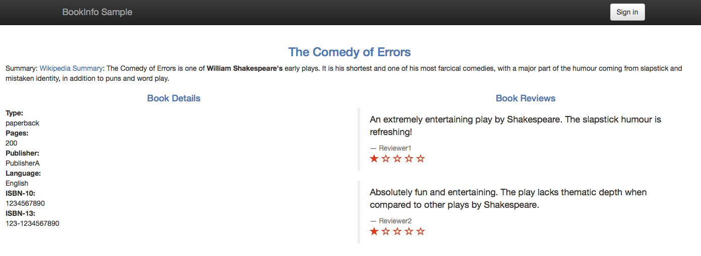

egress-tcp
================================================

.. note::

   This blog post was updated on July 23, 2018 to use the new
`v1alpha3 traffic management API </blog/2018/v1alpha3-routing/>`_. If
you need to use the old version, follow these
`docs <https://archive.istio.io/v0.7/blog/2018/egress-tcp.html>`_. 

In my previous blog post, `Consuming External Web
Services </blog/2018/egress-https/>`_, I described how external
services can be consumed by in-mesh Istio applications via HTTPS. In
this post, I demonstrate consuming external services over TCP. You will
use the `Istio Bookinfo sample
application </docs/examples/bookinfo/>`_, the version in which the book
ratings data is persisted in a MySQL database. You deploy this database
outside the cluster and configure the *ratings* microservice to use it.
You define a `Service
Entry </docs/reference/config/networking/service-entry/>`_ to allow the
in-mesh applications to access the external database.

Bookinfo sample application with external ratings database
----------------------------------------------------------

First, you set up a MySQL database instance to hold book ratings data
outside of your Kubernetes cluster. Then you modify the `Bookinfo sample
application </docs/examples/bookinfo/>`_ to use your database.

Setting up the database for ratings data
~~~~~~~~~~~~~~~~~~~~~~~~~~~~~~~~~~~~~~~~

For this task you set up an instance of
`MySQL <https://www.mysql.com>`_. You can use any MySQL instance; I
used `Compose for MySQL <https://www.ibm.com/cloud/compose/mysql>`_. I
used ``mysqlsh`` (`MySQL
Shell <https://dev.mysql.com/doc/mysql-shell/en/>`_) as a MySQL client
to feed the ratings data.

1. Set the ``MYSQL_DB_HOST`` and ``MYSQL_DB_PORT`` environment
   variables:

   .. code:: sh

      $ export MYSQL_DB_HOST= $ export MYSQL_DB_PORT=

   In case of a local MySQL database with the default port, the values
   are ``localhost`` and ``3306``, respectively.

2. To initialize the database, run the following command entering the
   password when prompted. The command is performed with the credentials
   of the ``admin`` user, created by default by `Compose for
   MySQL <https://www.ibm.com/cloud/compose/mysql>`_.

   .. code:: sh

      $ curl -s /samples/bookinfo/src/mysql/mysqldb-init.sql \| mysqlsh –sql
   –ssl-mode=REQUIRED -u admin -p –host $MYSQL_DB_HOST –port
   $MYSQL_DB_PORT

   **OR**

   When using the ``mysql`` client and a local MySQL database, run:

   .. code:: sh

      $ curl -s /samples/bookinfo/src/mysql/mysqldb-init.sql \| mysql -u root -p
   –host $MYSQL_DB_HOST –port $MYSQL_DB_PORT

3. Create a user with the name ``bookinfo`` and grant it *SELECT*
   privilege on the ``test.ratings`` table:

   .. code:: sh

      $ mysqlsh –sql –ssl-mode=REQUIRED -u admin -p –host
   $MYSQL_DB_HOST –port $MYSQL_DB_PORT -e “CREATE USER ‘bookinfo’
   IDENTIFIED BY ‘’; GRANT SELECT ON test.ratings to ‘bookinfo’;”

   **OR**

   For ``mysql`` and the local database, the command is:

   .. code:: sh

      $ mysql -u root -p –host $MYSQL_DB_HOST –port
   $MYSQL_DB_PORT -e “CREATE USER ‘bookinfo’ IDENTIFIED BY ‘’; GRANT
   SELECT ON test.ratings to ‘bookinfo’;”

   Here you apply the `principle of least
   privilege <https://en.wikipedia.org/wiki/Principle_of_least_privilege>`_.
   This means that you do not use your ``admin`` user in the Bookinfo
   application. Instead, you create a special user for the Bookinfo
   application , ``bookinfo``, with minimal privileges. In this case,
   the *bookinfo* user only has the ``SELECT`` privilege on a single
   table.

   After running the command to create the user, you may want to clean
   your bash history by checking the number of the last command and
   running
   ``history -d <the number of the command that created the user>``. You
   don’t want the password of the new user to be stored in the bash
   history. If you’re using ``mysql``, remove the last command from
   ``~/.mysql_history`` file as well. Read more about password
   protection of the newly created user in `MySQL
   documentation <https://dev.mysql.com/doc/refman/5.5/en/create-user.html>`_.

4. Inspect the created ratings to see that everything worked as
   expected:

   .. code:: sh

      $ mysqlsh –sql –ssl-mode=REQUIRED -u bookinfo -p
   –host $MYSQL_DB_HOST –port $MYSQL_DB_PORT -e “select \* from
   test.ratings;” Enter password: +———-+——–+ \| ReviewID \| Rating \|
   +———-+——–+ \| 1 \| 5 \| \| 2 \| 4 \| +———-+——–+

   **OR**

   For ``mysql`` and the local database:

   .. code:: sh

      $ mysql -u bookinfo -p –host $MYSQL_DB_HOST –port
   $MYSQL_DB_PORT -e “select \* from test.ratings;” Enter password:
   +———-+——–+ \| ReviewID \| Rating \| +———-+——–+ \| 1 \| 5 \| \| 2 \| 4
   \| +———-+——–+

5. Set the ratings temporarily to ``1`` to provide a visual clue when
   our database is used by the Bookinfo *ratings* service:

   .. code:: sh

      $ mysqlsh –sql –ssl-mode=REQUIRED -u admin -p –host
   $MYSQL_DB_HOST –port $MYSQL_DB_PORT -e “update test.ratings set
   rating=1; select \* from test.ratings;” Enter password:

   Rows matched: 2 Changed: 2 Warnings: 0 +———-+——–+ \| ReviewID \|
   Rating \| +———-+——–+ \| 1 \| 1 \| \| 2 \| 1 \| +———-+——–+ 

   **OR**

   For ``mysql`` and the local database:

   .. code:: sh

      $ mysql -u root -p –host $MYSQL_DB_HOST –port
   $MYSQL_DB_PORT -e “update test.ratings set rating=1; select \* from
   test.ratings;” Enter password: +———-+——–+ \| ReviewID \| Rating \|
   +———-+——–+ \| 1 \| 1 \| \| 2 \| 1 \| +———-+——–+

   You used the ``admin`` user (and ``root`` for the local database) in
   the last command since the ``bookinfo`` user does not have the
   ``UPDATE`` privilege on the ``test.ratings`` table.

Now you are ready to deploy a version of the Bookinfo application that
will use your database.

Initial setting of Bookinfo application
~~~~~~~~~~~~~~~~~~~~~~~~~~~~~~~~~~~~~~~

To demonstrate the scenario of using an external database, you start
with a Kubernetes cluster with `Istio
installed </docs/setup/getting-started/>`_. Then you deploy the `Istio
Bookinfo sample application </docs/examples/bookinfo/>`_, `apply the
default destination
rules </docs/examples/bookinfo/#apply-default-destination-rules>`_, and
`change Istio to the blocking-egress-by-default
policy </docs/tasks/traffic-management/egress/egress-control/#change-to-the-blocking-by-default-policy>`_.

This application uses the ``ratings`` microservice to fetch book
ratings, a number between 1 and 5. The ratings are displayed as stars
for each review. There are several versions of the ``ratings``
microservice. Some use `MongoDB <https://www.mongodb.com>`_, others use
`MySQL <https://www.mysql.com>`_ as their database.

The example commands in this blog post work with Istio 0.8+, with or
without `mutual
TLS </docs/concepts/security/#mutual-tls-authentication>`_ enabled.

As a reminder, here is the end-to-end architecture of the application
from the `Bookinfo sample application </docs/examples/bookinfo/>`_.

.. image:: /docs/examples/bookinfo/withistio.svg
   :alt: The original Bookinfo application
   :width: 80%

Use the database for ratings data in Bookinfo application
~~~~~~~~~~~~~~~~~~~~~~~~~~~~~~~~~~~~~~~~~~~~~~~~~~~~~~~~~

1. Modify the deployment spec of a version of the *ratings* microservice
   that uses a MySQL database, to use your database instance. The spec
   is in
   `samples/bookinfo/platform/kube/bookinfo-ratings-v2-mysql.yaml <%7B%7B%3Cgithub_blob%3E%7D%7D/samples/bookinfo/platform/kube/bookinfo-ratings-v2-mysql.yaml>`_
   of an Istio release archive. Edit the following lines:

   .. code:: yaml

   -  name: MYSQL_DB_HOST value: mysqldb
   -  name: MYSQL_DB_PORT value: “3306”
   -  name: MYSQL_DB_USER value: root
   -  name: MYSQL_DB_PASSWORD value: password

   Replace the values in the snippet above, specifying the database
   host, port, user, and password. Note that the correct way to work
   with passwords in container’s environment variables in Kubernetes is
   `to use
   secrets <https://kubernetes.io/docs/concepts/configuration/secret/#using-secrets-as-environment-variables>`_.
   For this example task only, you may want to write the password
   directly in the deployment spec. **Do not do it** in a real
   environment! I also assume everyone realizes that ``"password"``
   should not be used as a password…

2. Apply the modified spec to deploy the version of the *ratings*
   microservice, *v2-mysql*, that will use your database.

   .. code:: sh

      $ kubectl apply -f
   @samples/bookinfo/platform/kube/bookinfo-ratings-v2-mysql.yaml@
   deployment “ratings-v2-mysql” created

3. Route all the traffic destined to the *reviews* service to its *v3*
   version. You do this to ensure that the *reviews* service always
   calls the *ratings* service. In addition, route all the traffic
   destined to the *ratings* service to *ratings v2-mysql* that uses
   your database.

   Specify the routing for both services above by adding two `virtual
   services </docs/reference/config/networking/virtual-service/>`_.
   These virtual services are specified in
   ``samples/bookinfo/networking/virtual-service-ratings-mysql.yaml`` of
   an Istio release archive. **Important:** make sure you `applied the
   default destination
   rules </docs/examples/bookinfo/#apply-default-destination-rules>`_
   before running the following command.

   .. code:: sh

      $ kubectl apply -f
   @samples/bookinfo/networking/virtual-service-ratings-mysql.yaml@

The updated architecture appears below. Note that the blue arrows inside
the mesh mark the traffic configured according to the virtual services
we added. According to the virtual services, the traffic is sent to
*reviews v3* and *ratings v2-mysql*.

Note that the MySQL database is outside the Istio service mesh, or more
precisely outside the Kubernetes cluster. The boundary of the service
mesh is marked by a dashed line.

Access the webpage
~~~~~~~~~~~~~~~~~~

Access the webpage of the application, after `determining the ingress IP
and
port </docs/examples/bookinfo/#determine-the-ingress-ip-and-port>`_.

You have a problem… Instead of the rating stars, the message *“Ratings
service is currently unavailable”* is currently displayed below each
review:

.. image:: ./errorFetchingBookRating.png
   :alt: The Ratings service error messages
   :width: 80%

As in `Consuming External Web Services </blog/2018/egress-https/>`_,
you experience **graceful service degradation**, which is good. The
application did not crash due to the error in the *ratings*
microservice. The webpage of the application correctly displayed the
book information, the details, and the reviews, just without the rating
stars.

You have the same problem as in `Consuming External Web
Services </blog/2018/egress-https/>`_, namely all the traffic outside
the Kubernetes cluster, both TCP and HTTP, is blocked by default by the
sidecar proxies. To enable such traffic for TCP, a mesh-external service
entry for TCP must be defined.

Mesh-external service entry for an external MySQL instance
~~~~~~~~~~~~~~~~~~~~~~~~~~~~~~~~~~~~~~~~~~~~~~~~~~~~~~~~~~

TCP mesh-external service entries come to our rescue.

1. Get the IP address of your MySQL database instance. As an option, you
   can use the `host <https://linux.die.net/man/1/host>`_ command:

   .. code:: sh

      $ export MYSQL_DB_IP=$(host $MYSQL_DB_HOST \| grep
   " has address " \| cut -d" " -f4)

   For a local database, set ``MYSQL_DB_IP`` to contain the IP of your
   machine, accessible from your cluster.

2. Define a TCP mesh-external service entry:

   .. code:: sh

      $ kubectl apply -f - <<EOF apiVersion:
   networking.istio.io/v1alpha3 kind: ServiceEntry metadata: name:
   mysql-external spec: hosts:

   -  $MYSQL_DB_HOST addresses:
   -  $MYSQL_DB_IP/32 ports:
   -  name: tcp number: $MYSQL_DB_PORT protocol: tcp location:
      MESH_EXTERNAL EOF

3. Review the service entry you just created and check that it contains
   the correct values:

   .. code:: sh

      $ kubectl get serviceentry mysql-external -o yaml
   apiVersion: networking.istio.io/v1alpha3 kind: ServiceEntry metadata:
   …

Note that for a TCP service entry, you specify ``tcp`` as the protocol
of a port of the entry. Also note that you have to specify the IP of the
external service in the list of addresses, as a
`CIDR <https://tools.ietf.org/html/rfc2317>`_ block with suffix ``32``.

I will talk more about TCP service entries
`below <#service-entries-for-tcp-traffic>`_. For now, verify that the
service entry we added fixed the problem. Access the webpage and see if
the stars are back.

It worked! Accessing the web page of the application displays the
ratings without error:

Note that you see a one-star rating for both displayed reviews, as
expected. You changed the ratings to be one star to provide us with a
visual clue that our external database is indeed being used.

As with service entries for HTTP/HTTPS, you can delete and create
service entries for TCP using ``kubectl``, dynamically.

Motivation for egress TCP traffic control
-----------------------------------------

Some in-mesh Istio applications must access external services, for
example legacy systems. In many cases, the access is not performed over
HTTP or HTTPS protocols. Other TCP protocols are used, such as
database-specific protocols like `MongoDB Wire
Protocol <https://docs.mongodb.com/manual/reference/mongodb-wire-protocol/>`_
and `MySQL Client/Server
Protocol <https://dev.mysql.com/doc/internals/en/client-server-protocol.html>`_
to communicate with external databases.

Next let me provide more details about the service entries for TCP
traffic.

Service entries for TCP traffic
-------------------------------

The service entries for enabling TCP traffic to a specific port must
specify ``TCP`` as the protocol of the port. Additionally, for the
`MongoDB Wire
Protocol <https://docs.mongodb.com/manual/reference/mongodb-wire-protocol/>`_,
the protocol can be specified as ``MONGO``, instead of ``TCP``.

For the ``addresses`` field of the entry, a block of IPs in
`CIDR <https://tools.ietf.org/html/rfc2317>`_ notation must be used.
Note that the ``hosts`` field is ignored for TCP service entries.

To enable TCP traffic to an external service by its hostname, all the
IPs of the hostname must be specified. Each IP must be specified by a
CIDR block.

Note that all the IPs of an external service are not always known. To
enable egress TCP traffic, only the IPs that are used by the
applications must be specified.

Also note that the IPs of an external service are not always static, for
example in the case of
`CDNs <https://en.wikipedia.org/wiki/Content_delivery_network>`_.
Sometimes the IPs are static most of the time, but can be changed from
time to time, for example due to infrastructure changes. In these cases,
if the range of the possible IPs is known, you should specify the range
by CIDR blocks. If the range of the possible IPs is not known, service
entries for TCP cannot be used and `the external services must be called
directly </docs/tasks/traffic-management/egress/egress-control/#direct-access-to-external-services>`_,
bypassing the sidecar proxies.

Relation to virtual machines support
------------------------------------

Note that the scenario described in this post is different from the
`Bookinfo with Virtual
Machines </docs/examples/virtual-machines/bookinfo/>`_ example. In that
scenario, a MySQL instance runs on an external (outside the cluster)
machine (a bare metal or a VM), integrated with the Istio service mesh.
The MySQL service becomes a first-class citizen of the mesh with all the
beneficial features of Istio applicable. Among other things, the service
becomes addressable by a local cluster domain name, for example by
``mysqldb.vm.svc.cluster.local``, and the communication to it can be
secured by `mutual TLS
authentication </docs/concepts/security/#mutual-tls-authentication>`_.
There is no need to create a service entry to access this service;
however, the service must be registered with Istio. To enable such
integration, Istio components (*Envoy proxy*, *node-agent*,
``_istio-agent_``) must be installed on the machine and the Istio
control plane (*Pilot*, *Mixer*, *Citadel*) must be accessible from it.
See the `Istio VM-related </docs/examples/virtual-machines/>`_ tasks
for more details.

In our case, the MySQL instance can run on any machine or can be
provisioned as a service by a cloud provider. There is no requirement to
integrate the machine with Istio. The Istio control plane does not have
to be accessible from the machine. In the case of MySQL as a service,
the machine which MySQL runs on may be not accessible and installing on
it the required components may be impossible. In our case, the MySQL
instance is addressable by its global domain name, which could be
beneficial if the consuming applications expect to use that domain name.
This is especially relevant when that expected domain name cannot be
changed in the deployment configuration of the consuming applications.

Cleanup
-------

1. Drop the ``test`` database and the ``bookinfo`` user:

   .. code:: sh

      $ mysqlsh –sql –ssl-mode=REQUIRED -u admin -p –host
   $MYSQL_DB_HOST –port $MYSQL_DB_PORT -e “drop database test; drop user
   bookinfo;”

   **OR**

   For ``mysql`` and the local database:

   .. code:: sh

      $ mysql -u root -p –host $MYSQL_DB_HOST –port
   $MYSQL_DB_PORT -e “drop database test; drop user bookinfo;” 

2. Remove the virtual services:

   .. code:: sh

      $ kubectl delete -f
   @samples/bookinfo/networking/virtual-service-ratings-mysql.yaml@
   Deleted config: virtual-service/default/reviews Deleted config:
   virtual-service/default/ratings

3. Undeploy *ratings v2-mysql*:

   .. code:: sh

      $ kubectl delete -f
   @samples/bookinfo/platform/kube/bookinfo-ratings-v2-mysql.yaml@
   deployment “ratings-v2-mysql” deleted

4. Delete the service entry:

   .. code:: sh

      $ kubectl delete serviceentry mysql-external -n
   default Deleted config: serviceentry mysql-external

Conclusion
----------

In this blog post, I demonstrated how the microservices in an Istio
service mesh can consume external services via TCP. By default, Istio
blocks all the traffic, TCP and HTTP, to the hosts outside the cluster.
To enable such traffic for TCP, TCP mesh-external service entries must
be created for the service mesh.
