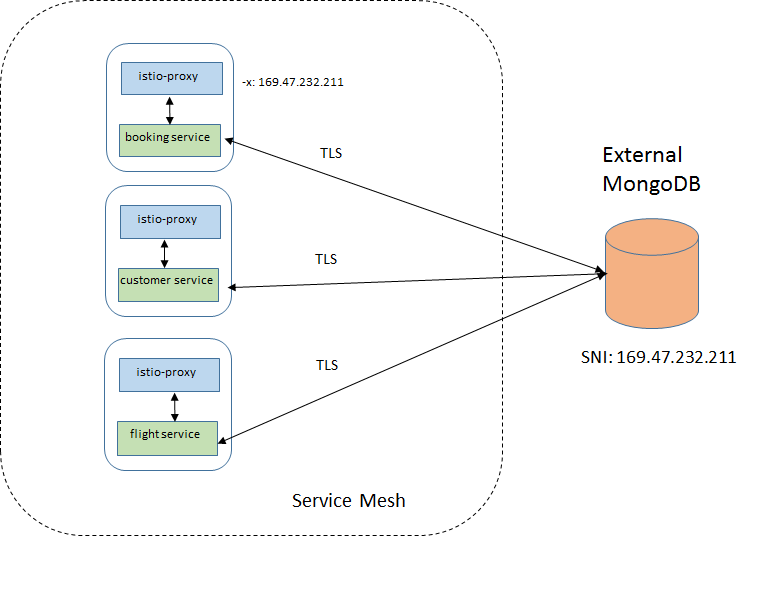
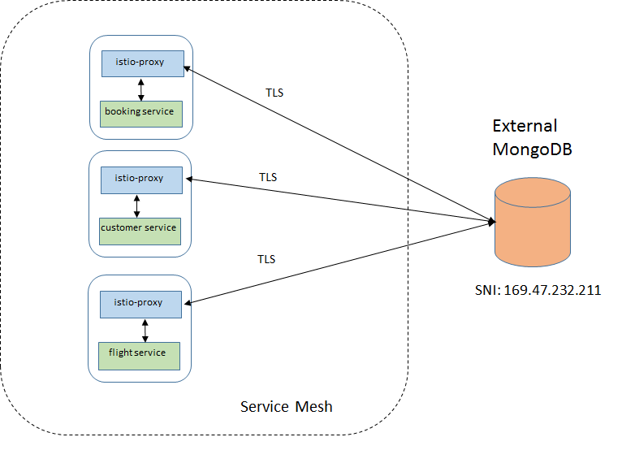
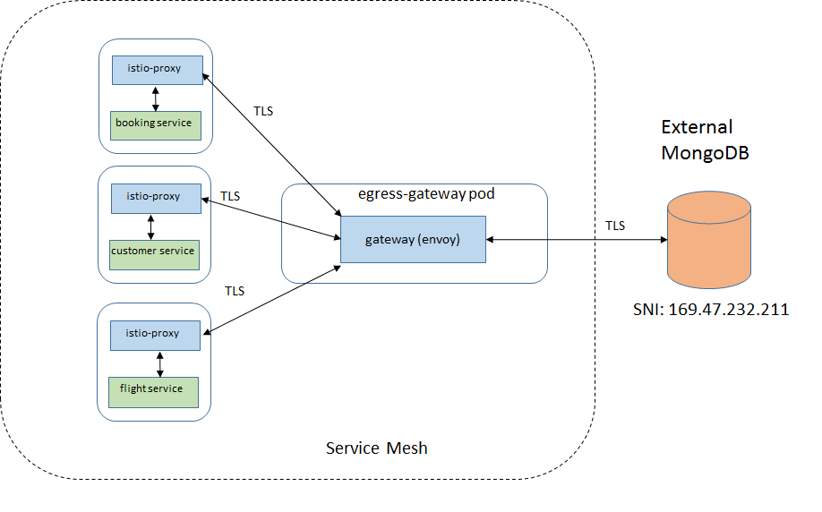
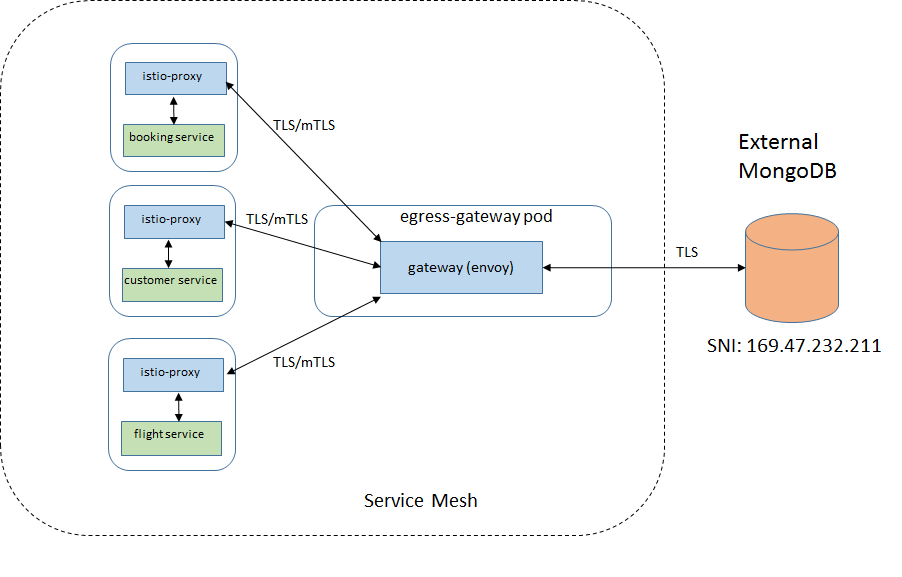
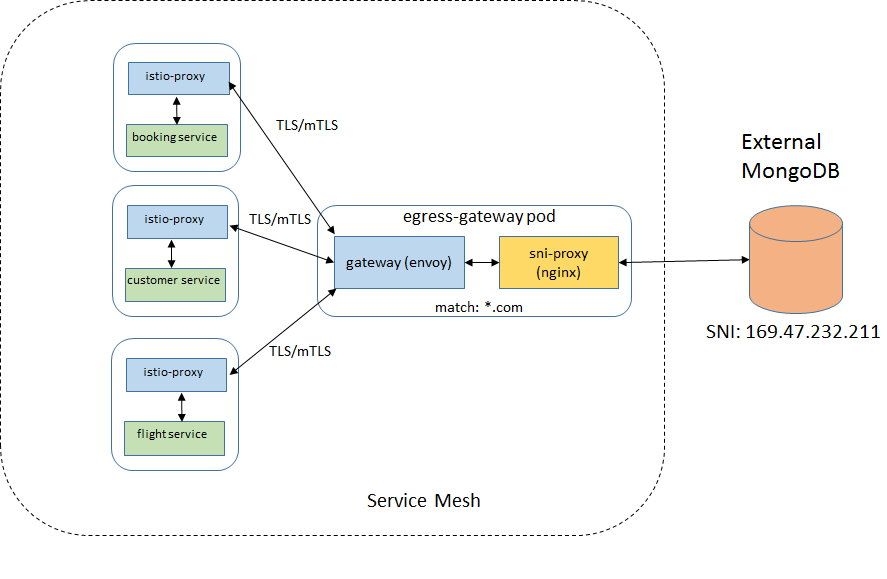
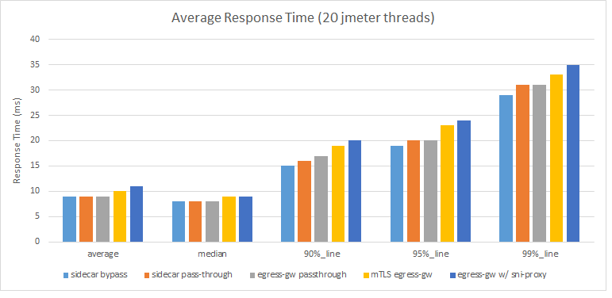

egress-performance
================================================

The main objective of this investigation was to determine the impact on
performance and resource utilization when an egress gateway is added in
the service mesh to access an external service (MongoDB, in this case).
The steps to configure an egress gateway for an external MongoDB are
described in the blog `Consuming External MongoDB
Services </blog/2018/egress-mongo/>`_.

The application used for this investigation was the Java version of
Acmeair, which simulates an airline reservation system. This application
is used in the Performance Regression Patrol of Istio daily builds, but
on that setup the microservices have been accessing the external MongoDB
directly via their sidecars, without an egress gateway.

The diagram below illustrates how regression patrol currently runs with
Acmeair and Istio:

.. image:: ./acmeair_regpatrol3.png
   :alt:
   :caption: Acmeair benchmark in the Istio performance regression patrol environment
   :width: 70%

Another difference is that the application communicates with the
external DB with plain MongoDB protocol. The first change made for this
study was to establish a TLS communication between the MongoDB and its
clients running within the application, as this is a more realistic
scenario.

Several cases for accessing the external database from the mesh were
tested and described next.

Egress traffic cases
--------------------

Case 1: Bypassing the sidecar
~~~~~~~~~~~~~~~~~~~~~~~~~~~~~

In this case, the sidecar does not intercept the communication between
the application and the external DB. This is accomplished by setting the
init container argument -x with the CIDR of the MongoDB, which makes the
sidecar ignore messages to/from this IP address. For example:

::

       - -x
       - "169.47.232.211/32"

Case 2: Through the sidecar, with service entry
~~~~~~~~~~~~~~~~~~~~~~~~~~~~~~~~~~~~~~~~~~~~~~~

This is the default configuration when the sidecar is injected into the
application pod. All messages are intercepted by the sidecar and routed
to the destination according to the configured rules, including the
communication with external services. The MongoDB was defined as a
``ServiceEntry``.

Case 3: Egress gateway
~~~~~~~~~~~~~~~~~~~~~~

The egress gateway and corresponding destination rule and virtual
service resources are defined for accessing MongoDB. All traffic to and
from the external DB goes through the egress gateway (envoy).

Case 4: Mutual TLS between sidecars and the egress gateway
~~~~~~~~~~~~~~~~~~~~~~~~~~~~~~~~~~~~~~~~~~~~~~~~~~~~~~~~~~

In this case, there is an extra layer of security between the sidecars
and the gateway, so some impact in performance is expected.

Case 5: Egress gateway with SNI proxy
~~~~~~~~~~~~~~~~~~~~~~~~~~~~~~~~~~~~~

This scenario is used to evaluate the case where another proxy is
required to access wildcarded domains. This may be required due current
limitations of envoy. An nginx proxy was created as sidecar in the
egress gateway pod.

Environment
-----------

-  Istio version: 1.0.2
-  ``K8s`` version: ``1.10.5_1517``
-  Acmeair App: 4 services (1 replica of each), inter-services
   transactions, external Mongo DB, avg payload: 620 bytes.

Results
-------

``Jmeter`` was used to generate the workload which consisted in a
sequence of 5-minute runs, each one using a growing number of clients
making http requests. The number of clients used were 1, 5, 10, 20, 30,
40, 50 and 60.

Throughput
~~~~~~~~~~

The chart below shows the throughput obtained for the different cases:

.. image:: ./throughput3.png
   :alt:
   :caption: Throughput obtained for the different cases
   :width: 75%

As you can see, there is no major impact in having sidecars and the
egress gateway between the application and the external MongoDB, but
enabling mutual TLS and then adding the SNI proxy caused a degradation
in the throughput of about 10% and 24%, respectively.

Response time
~~~~~~~~~~~~~

The average response times for the different requests were collected
when traffic was being driven with 20 clients. The chart below shows the
average, median, 90%, 95% and 99% average values for each case:

Likewise, not much difference in the response times for the 3 first
cases, but mutual TLS and the extra proxy adds noticeable latency.

CPU utilization
~~~~~~~~~~~~~~~

The CPU usage was collected for all Istio components as well as for the
sidecars during the runs. For a fair comparison, CPU used by Istio was
normalized by the throughput obtained for a given run. The results are
shown in the following graph:

.. image:: ./cpu_usage3.png
   :alt:
   :caption: CPU usage normalized by TPS
   :width: 75%

In terms of CPU consumption per transaction, Istio has used
significantly more CPU only in the egress gateway + SNI proxy case.

Conclusion
----------

In this investigation, we tried different options to access an external
TLS-enabled MongoDB to compare their performance. The introduction of
the Egress Gateway did not have a significant impact on the performance
nor meaningful additional CPU consumption. Only when enabling mutual TLS
between sidecars and egress gateway or using an additional SNI proxy for
wildcarded domains we could observe some degradation.
