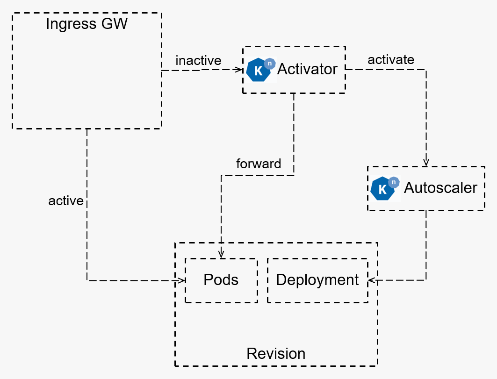
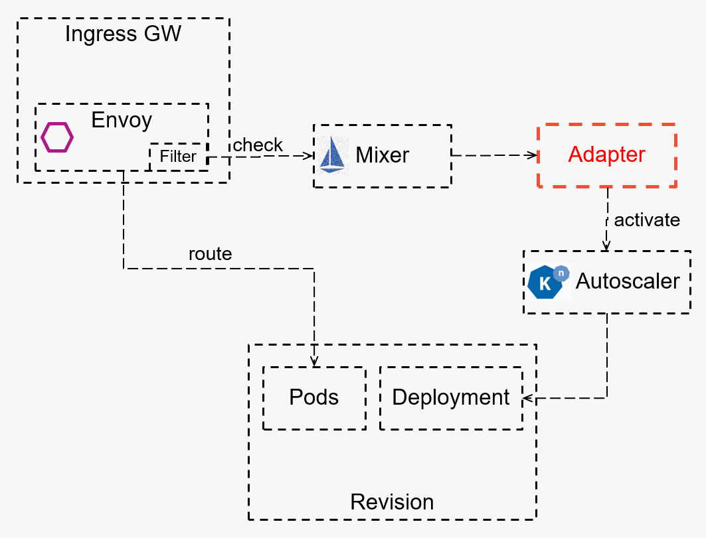

knative-activator-adapter
================================================

This post demonstrates how you can use `Mixer </faq/mixer/>`_ to push
application logic into Istio. It describes a Mixer adapter which
implements the `Knative <https://knative.dev/>`_ scale-from-zero logic
with simple code and similar performance to the original implementation.

Knative serving
---------------

`Knative Serving <https://knative.dev/docs/serving/>`_ builds on
`Kubernetes <https://kubernetes.io/>`_ to support deploying and serving
of serverless applications. A core capability of serverless platforms is
scale-to-zero functionality which reduces resource usage and cost of
inactive workloads. A new mechanism is required to scale from zero when
an idle application receives a new request.

The following diagram represents the current Knative architecture for
scale-from-zero.

The traffic for an idle application is redirected to **Activator**
component by programming Istio with ``VirtualServices`` and
``DestinationRules``. When **Activator** receives a new request, it:

1. buffers incoming requests
2. triggers the **Autoscaler**
3. redirects requests to the application after it has been scaled up,
   including retries and load-balancing (if needed)

Once the application is up and running again, Knative restores the
routing from **Activator** to the running application.

Mixer adapter
-------------

`Mixer </faq/mixer/>`_ provides a rich intermediation layer between the
Istio components and infrastructure backends. It is designed as a
stand-alone component, separate from
`Envoy <https://www.envoyproxy.io/>`_, and has a simple extensibility
model to enable Istio to interoperate with a wide breadth of backends.
Mixer is inherently easier to extend than Envoy is.

Mixer is an attribute processing engine that uses operator-supplied
configuration to map request attributes from the Istio proxy into calls
to the infrastructure backends systems via a pluggable set of adapters.
Adapters enable **Mixer** to expose a single consistent API, independent
of the infrastructure backends in use. The exact set of adapters used at
runtime is determined through operator configuration and can easily be
extended to target new or custom infrastructure backends.

In order to achieve Knative scale-from-zero, we use a Mixer
`out-of-process
adapter <https://github.com/istio/istio/wiki/Mixer-Out-Of-Process-Adapter-Dev-Guide>`_
to call the Autoscaler. Out-of-process adapters for Mixer allow
developers to use any programming language and to build and maintain
your extension as a stand-alone program without the need to build the
Istio proxy.

The following diagram represents the Knative design using the **Mixer**
adapter.

In this design, there is no need to change the routing from/to
**Activator** for an idle application as in the original Knative setup.
When the Istio proxy represented by the ingress gateway component
receives a new request for an idle application, it informs **Mixer**,
including all the relevant metadata information. **Mixer** then calls
your adapter which triggers the Knative **Autoscaler** using the
original Knative protocol.

.. note::

   By using this design you do not need to deal with
buffering, retries and load-balancing because it is already handled by
the Istio proxy.

Istio’s use of Mixer adapters makes it possible to replace otherwise
complex networking-based application logic with a more straightforward
implementation, as demonstrated in the `Knative
adapter <https://github.com/zachidan/istio-kactivator>`_.

When the adapter receives a message from **Mixer**, it sends a
``StatMessage`` directly to **Autoscaler** component using the Knative
protocol. The metadata information (``namespace`` and ``service name``)
required by **Autoscaler** are transferred by Istio proxy to **Mixer**
and from there to the adapter.

Summary
-------

I compared the cold-start time of the original Knative reference
architecture to the new Istio Mixer adapter reference architecture. The
results show similar cold-start times. The implementation using the
Mixer adapter has greater simplicity. It is not necessary to handle
low-level network-based mechanisms as these are handled by Envoy.

The next step is converting this Mixer adapter into an Envoy-specific
filter running inside an ingress gateway. This will allow to further
improve the latency overhead (no more calls to **Mixer** and the
adapter) and to remove the dependency on the Istio Mixer.
