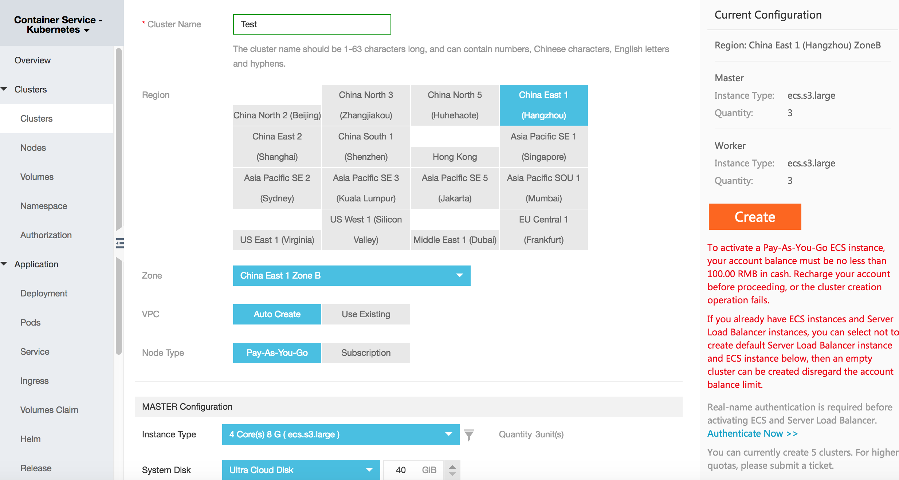

Alibaba Cloud
============================

Follow these instructions to prepare an `Alibaba Cloud Kubernetes Container Service <https://www.alibabacloud.com/product/kubernetes>`_ cluster for Istio.
You can deploy a Kubernetes cluster to Alibaba Cloud quickly and easily in the ``Container Service console``, which fully supports Istio.

.. note::

   To install and configure an Istio mesh in the Alibaba Cloud Kubernetes Container Service using the ``Application Catalog`` module, follow the `Alibaba Application Catalog instructions <https://archive.istio.io/v1.1/docs/setup/kubernetes/install/platform/alicloud/>`_ instead.

Prerequisites
-------------

1. `Follow the Alibaba Cloud instructions <https://www.alibabacloud.com/help/doc-detail/53752.htm>`_
   to activate the following services: Container Service, Resource Orchestration Service (ROS), and RAM.

Procedure
---------

1. Log on to the ``Container Service console``, and click **Clusters** under **Kubernetes** in the left-side navigation pane to enter the **Cluster List** page.
2. Click the **Create Kubernetes Cluster** button in the upper-right corner.
3. Enter the cluster name. The cluster name can be 1–63 characters long and it can contain numbers, Chinese characters, English letters, and hyphens (-).
4. Select the **region** and **zone** in which the cluster resides.
5. Set the cluster network type. Kubernetes clusters only support the VPC network type now.
6. Configure the node type, Pay-As-You-Go and Subscription types are supported.
7. Configure the master nodes. Select the generation, family, and type for the master nodes.
8. Configure the worker nodes. Select whether to create a worker node or add an existing ECS instance as the worker node.
9. Configure the logon mode, and configure the Pod Network CIDR and  Service CIDR.

The image below shows the GUI where you complete all the previous steps:

