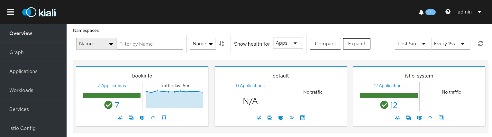
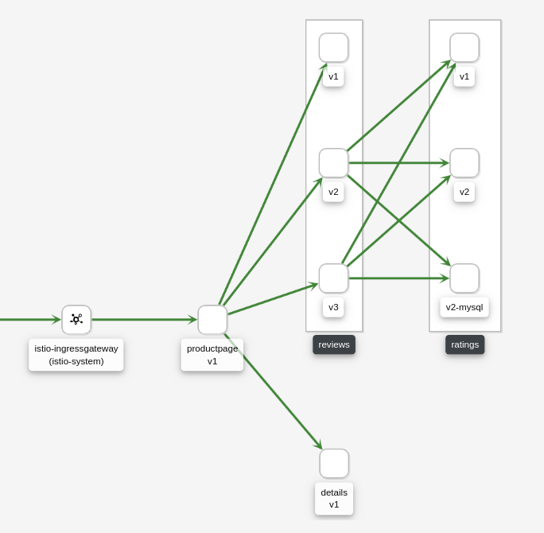
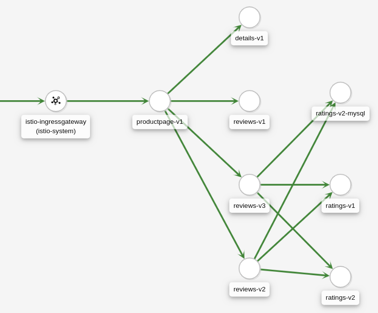
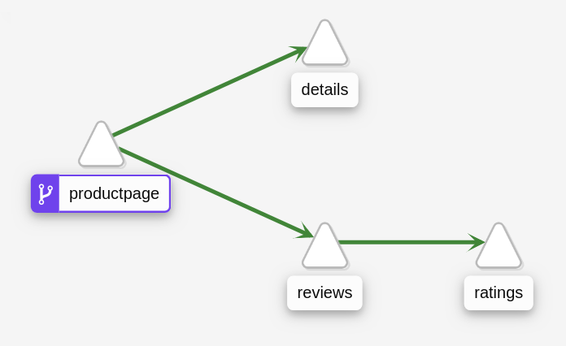
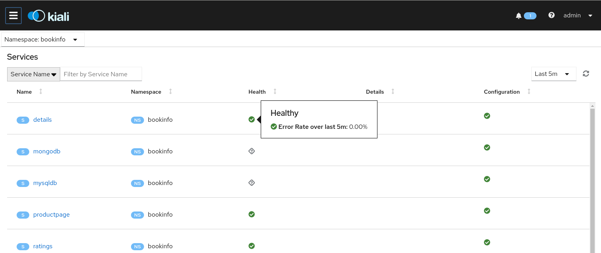
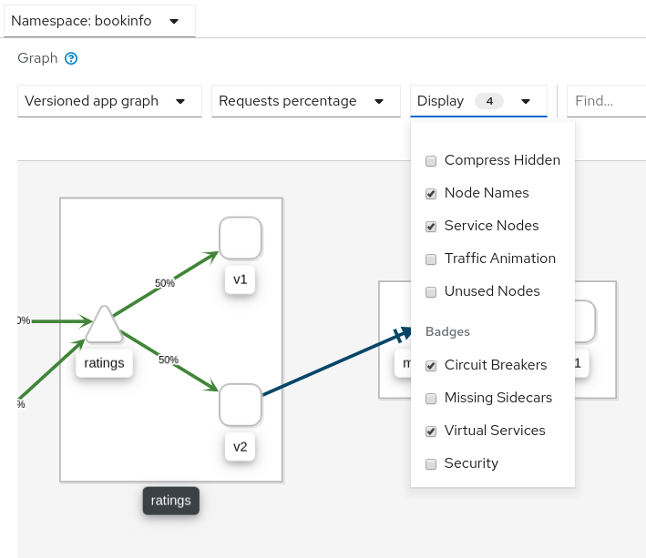
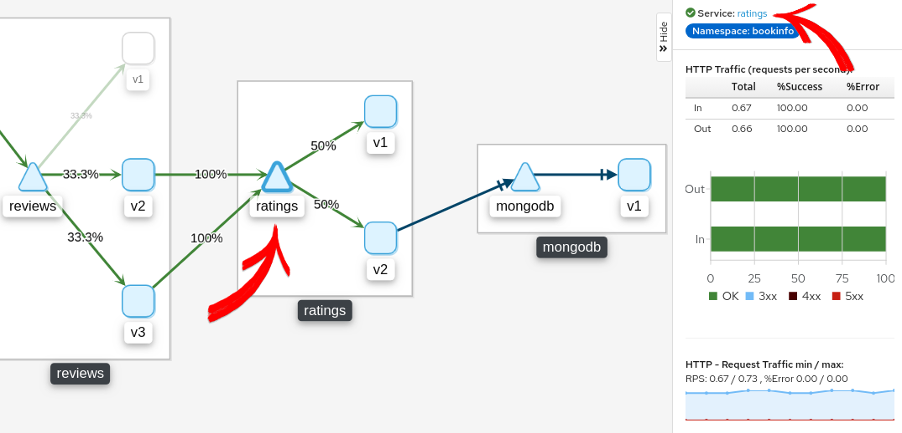
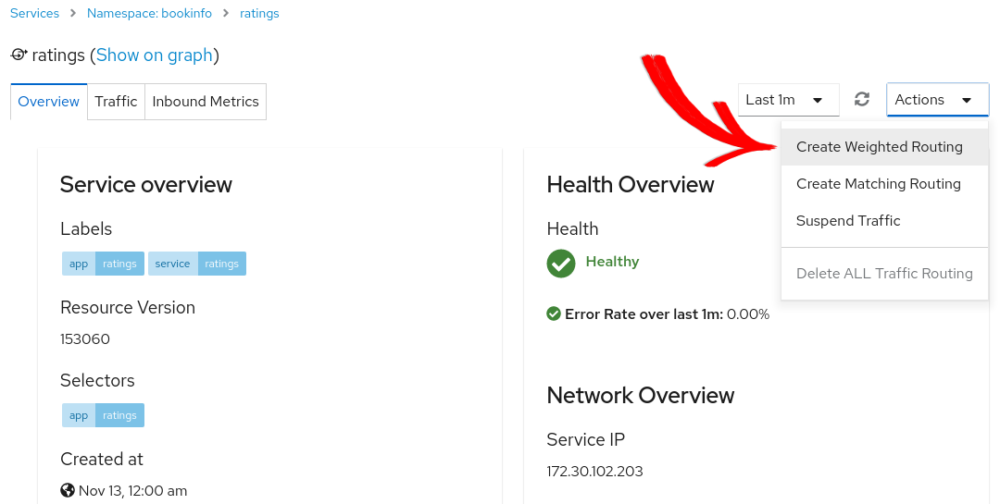

kiali
========

This task shows you how to visualize different aspects of your Istio
mesh.

As part of this task, you install the `Kiali <https://www.kiali.io>`_
add-on and use the web-based graphical user interface to view service
graphs of the mesh and your Istio configuration objects. Lastly, you use
the Kiali Public API to generate graph data in the form of consumable
JSON.

.. note::

   This task does not cover all of the features provided by
Kiali. To learn about the full set of features it supports, see the
`Kiali website <http://kiali.io/documentation/features/>`_. 

This task uses the `Bookinfo </docs/examples/bookinfo/>`_ sample
application as the example throughout.

Before you begin
----------------

.. note::

   The following instructions assume you have installed
``istioctl`` and will use it to install Kiali. To install Kiali without
``istioctl``, follow the `Kiali installation
instructions <https://www.kiali.io/documentation/getting-started/>`_.

Create a secret
~~~~~~~~~~~~~~~

.. note::

   If you plan on installing Kiali using the Istio demo profile
as described in the `Istio Quick Start Installation
Steps </docs/setup/getting-started/>`_ then a default secret will be
created for you with a username of ``admin`` and passphrase of
``admin``. You can therefore skip this section.

Create a secret in your Istio namespace with the credentials that you
use to authenticate to Kiali.

First, define the credentials you want to use as the Kiali username and
passphrase.

Enter a Kiali username when prompted:

.. code:: sh

      $ KIALI_USERNAME=$(read -p ‘Kiali Username:’ uval &&
echo -n $uval \| base64)

Enter a Kiali passphrase when prompted:

.. code:: sh

      $ KIALI_PASSPHRASE=$(read -sp ‘Kiali Passphrase:’ pval
&& echo -n $pval \| base64)

If you are using the Z Shell, ``zsh``, use the following to define the
credentials:

.. code:: sh

      $ KIALI_USERNAME=$(read ‘?Kiali Username:’ uval &&
echo -n $uval \| base64) $ KIALI_PASSPHRASE=$(read -s “?Kiali
Passphrase:” pval && echo -n $pval \| base64)

To create a secret, run the following commands:

.. code:: sh

      $ NAMESPACE=istio-system $ kubectl create namespace
$NAMESPACE

.. code:: sh

      $ cat <<EOF \| kubectl apply -f - apiVersion: v1 kind:
Secret metadata: name: kiali namespace: $NAMESPACE labels: app: kiali
type: Opaque data: username: $KIALI_USERNAME passphrase:
$KIALI_PASSPHRASE EOF

Install via ``istioctl``
~~~~~~~~~~~~~~~~~~~~~~~~

Once you create the Kiali secret, follow `the install
instructions </docs/setup/install/istioctl/>`_ to install Kiali via
``istioctl``. For example:

.. code:: sh

      $ istioctl manifest apply –set
values.kiali.enabled=true

.. note::

   This task does not discuss Jaeger and Grafana. If you
already installed them in your cluster and you want to see how Kiali
integrates with them, you must pass additional arguments to the
``istioctl`` command, for example:

| .. code:: sh

      $ istioctl manifest apply
| –set values.kiali.enabled=true
| –set “values.kiali.dashboard.jaegerURL=http://jaeger-query:16686”
| –set “values.kiali.dashboard.grafanaURL=http://grafana:3000” 

Once you install Istio and Kiali, deploy the
`Bookinfo </docs/examples/bookinfo/>`_ sample application.

Running on OpenShift
~~~~~~~~~~~~~~~~~~~~

When Kiali runs on OpenShift it needs access to some OpenShift specific
resources in order to function properly, which can be done using the
following commands after Kiali has been installed:

.. code:: sh

      $ oc patch clusterrole kiali -p ‘[{“op”:“add”,
“path”:“/rules/-”, “value”:{“apiGroups”:[“apps.openshift.io”],
“resources”:[“deploymentconfigs”],“verbs”: [“get”, “list”, “watch”]}}]’
–type json $ oc patch clusterrole kiali -p ‘[{“op”:“add”,
“path”:“/rules/-”, “value”:{“apiGroups”:[“project.openshift.io”],
“resources”:[“projects”],“verbs”: [“get”]}}]’ –type json $ oc patch
clusterrole kiali -p ‘[{“op”:“add”, “path”:“/rules/-”,
“value”:{“apiGroups”:[“route.openshift.io”],
“resources”:[“routes”],“verbs”: [“get”]}}]’ –type json

Generating a service graph
--------------------------

1. To verify the service is running in your cluster, run the following
   command:

   .. code:: sh

      $ kubectl -n istio-system get svc kiali 

2. To determine the Bookinfo URL, follow the instructions to determine
   the `Bookinfo ingress
   ``GATEWAY_URL`` </docs/examples/bookinfo/#determine-the-ingress-ip-and-port>`_.

3. To send traffic to the mesh, you have three options

   -  Visit ``http://$GATEWAY_URL/productpage`` in your web browser

   -  Use the following command multiple times:

      .. code:: sh

      $ curl http://$GATEWAY_URL/productpage 

   -  If you installed the ``watch`` command in your system, send
      requests continually with:

      .. code:: sh

      $ watch -n 1 curl -o /dev/null -s -w
      %{http_code} $GATEWAY_URL/productpage

4. To open the Kiali UI, execute the following command in your
   Kubernetes environment:

   .. code:: sh

      $ istioctl dashboard kiali

5. To log into the Kiali UI, go to the Kiali login screen and enter the
   username and passphrase stored in the Kiali secret.

6. View the overview of your mesh in the **Overview** page that appears
   immediately after you log in. The **Overview** page displays all the
   namespaces that have services in your mesh. The following screenshot
   shows a similar page:

7. To view a namespace graph, click on the ``bookinfo`` graph icon in
   the Bookinfo namespace card. The graph icon is in the lower left of
   the namespace card and looks like a connected group of circles. The
   page looks similar to:

.. image:: ./kiali-graph.png
   :alt:
   :caption: Example Graph
   :width: 75%

8. To view a summary of metrics, select any node or edge in the graph to
   display its metric details in the summary details panel on the right.

9. To view your service mesh using different graph types, select a graph
   type from the **Graph Type** drop down menu. There are several graph
   types to choose from: **App**, **Versioned App**, **Workload**,
   **Service**.

   -  The **App** graph type aggregates all versions of an app into a
      single graph node. The following example shows a single
      **reviews** node representing the three versions of the reviews
      app.

      .. image:: ./kiali-app.png
         :alt:
         :caption: Example App Graph
         :width: 75%

   -  The **Versioned App** graph type shows a node for each version of
      an app, but all versions of a particular app are grouped together.
      The following example shows the **reviews** group box that
      contains the three nodes that represents the three versions of the
      reviews app.

   -  The **Workload** graph type shows a node for each workload in your
      service mesh. This graph type does not require you to use the
      ``app`` and ``version`` labels so if you opt to not use those
      labels on your components, this is the graph type you will use.

   -  The **Service** graph type shows a node for each service in your
      mesh but excludes all apps and workloads from the graph.

Examining Istio configuration
-----------------------------

1. To view detailed information about Istio configuration, click on the
   **Applications**, **Workloads**, and **Services** menu icons on the
   left menu bar. The following screenshot shows information for the
   Bookinfo application:

Creating weighted routes
------------------------

You can use the Kiali weighted routing wizard to define the specific
percentage of request traffic to route to two or more workloads.

1. View the **Versioned app graph** of the ``bookinfo`` graph.

   -  Make sure you have selected **Requests percentage** in the **Edge
      Labels** drop down menu to see the percentage of traffic routed to
      each workload.

   -  Make sure you have selected the **Service Nodes** check box in the
      **Display** drop down menu to view the service nodes in the graph.

2. Focus on the ``ratings`` service within the ``bookinfo`` graph by
   clicking on the ``ratings`` service (triangle) node. Notice the
   ``ratings`` service traffic is evenly distributed to the two
   ``ratings`` workloads ``v1`` and ``v2`` (50% of requests are routed
   to each workload).

3. Click the **ratings** link found in the side panel to go to the
   service view for the ``ratings`` service.

4. From the **Action** drop down menu, select **Create Weighted
   Routing** to access the weighted routing wizard.

5. Drag the sliders to specify the percentage of traffic to route to
   each workload. For ``ratings-v1``, set it to 10%; for ``ratings-v2``
   set it to 90%.

.. image:: ./kiali-wiz3-weighted-routing-wizard.png
   :alt:
   :caption: Weighted Routing Wizard
   :width: 80%

6. Click the **Create** button to create the new routing.

7. Click **Graph** in the left hand navigation bar to return to the
   ``bookinfo`` graph.

8. Send requests to the ``bookinfo`` application. For example, to send
   one request per second, you can execute this command if you have
   ``watch`` installed on your system:

   .. code:: sh

      $ watch -n 1 curl -o /dev/null -s -w %{http_code}
   $GATEWAY_URL/productpage

9. After a few minutes you will notice that the traffic percentage will
   reflect the new traffic route, thus confirming the fact that your new
   traffic route is successfully routing 90% of all traffic requests to
   ``ratings-v2``.

.. image::./kiali-wiz4-ratings-weighted-route-90-10.png
   :alt:
   :caption: 90% Ratings Traffic Routed to ratings-v2
   :width: 80%

Validating Istio configuration
------------------------------

Kiali can validate your Istio resources to ensure they follow proper
conventions and semantics. Any problems detected in the configuration of
your Istio resources can be flagged as errors or warnings depending on
the severity of the incorrect configuration. See the `Kiali validations
page <http://kiali.io/documentation/validations/>`_ for the list of all
validation checks Kiali performs.

.. note::

   Istio 1.4 introduces ``istioctl analyze`` which lets you
perform similar analysis in a way that can be used in a CI pipeline. 

Force an invalid configuration of a service port name to see how Kiali
reports a validation error.

1. Change the port name of the ``details`` service from ``http`` to
   ``foo``:

   .. code:: sh

      $ kubectl patch service details -n bookinfo –type
   json -p ‘[{“op”:“replace”,“path”:“/spec/ports/0/name”,
   “value”:“foo”}]’

2. Navigate to the **Services** list by clicking **Services** on the
   left hand navigation bar.

3. Select ``bookinfo`` from the **Namespace** drop down menu if it is
   not already selected.

4. Notice the error icon displayed in the **Configuration** column of
   the ``details`` row.

.. image::./kiali-validate1-list.png
   :alt:
   :caption:Services List Showing Invalid Configuration
   :width: 80%

5. Click the **details** link in the **Name** column to navigate to the
   service details view.

6. Hover over the error icon to display a tool tip describing the error.

.. image::./kiali-validate2-errormsg.png
   :alt:
   :caption:Service Details Describing the Invalid Configuration
   :width: 80%

7. Change the port name back to ``http`` to correct the configuration
   and return ``bookinfo`` back to its normal state.

   .. code:: sh

      $ kubectl patch service details -n bookinfo –type
   json -p ‘[{“op”:“replace”,“path”:“/spec/ports/0/name”,
   “value”:“http”}]’

.. image::./kiali-validate3-ok.png
   :alt:
   :caption:Service Details Showing Valid Configuration
   :width: 80%

Viewing and editing Istio configuration YAML
--------------------------------------------

Kiali provides a YAML editor for viewing and editing Istio configuration
resources. The YAML editor will also provide validation messages when it
detects incorrect configurations.

1.  Create Bookinfo destination rules:

    .. code:: sh

      $ kubectl apply -f
    @samples/bookinfo/networking/destination-rule-all.yaml@ 

2.  Click ``Istio Config`` on the left hand navigation bar to navigate
    to the Istio configuration list.

3.  Select ``bookinfo`` from the **Namespace** drop down menu if it is
    not already selected.

4.  Notice the error messages and the error and warning icons that alert
    you to several configuration problems.

.. image::./kiali-istioconfig0-errormsgs.png
   :alt:
   :caption:Istio Config List Incorrect Configuration Messages
   :width: 80%

5.  Hover over the error icon in the **Configuration** column of the
    ``details`` row to see additional messages.

.. image::./kiali-istioconfig1-tooltip.png
   :alt:
   :caption:Istio Config List Incorrect Configuration Tool Tips
   :width: 80%

6.  Click the **details** link in the **Name** column to navigate to the
    ``details`` destination rule view.

7.  Notice the messages and icons that alert you to several validation
    rules that failed.

.. image::./kiali-istioconfig2-details-errormsgs.png
   :alt:
   :caption:Istio Configuration Details View Showing Errors
   :width: 80%

8.  Click the **YAML** tab to view the YAML for this Istio destination
    rule resource.

9.  Notice the color highlights and icons on the rows that have failed
    validation checks.

.. image::./kiali-istioconfig3-details-yaml1.png
   :alt:
   :caption:YAML Editor Showing Validation Errors and Warnings
   :width: 80%

10. Hover over the yellow icon to view the tool tip message that informs
    you of the validation check that triggered the warning. For more
    details on the cause of the warning and how to resolve it, look up
    the validation warning message on the `Kiali Validations
    page <http://kiali.io/documentation/validations/>`_.

.. image::./kiali-istioconfig3-details-yaml2.png
   :alt:
   :caption:YAML Editor Showing Warning Tool Tip
   :width: 80%

11. Hover over the red icon to view the tool tip message that informs
    you of the validation check that triggered the error. For more
    details on the cause of the error and how to resolve it, look up the
    validation error message on the `Kiali Validations
    page <http://kiali.io/documentation/validations/>`_.

.. image::./kiali-istioconfig3-details-yaml3.png
   :alt:
   :caption:YAML Editor Showing Error Tool Tip
   :width: 80%

12. Delete the destination rules to return ``bookinfo`` back to its
    original state.

    .. code:: sh

      $ kubectl delete -f
    samples/bookinfo/networking/destination-rule-all.yaml

About the Kiali Public API
--------------------------

To generate JSON files representing the graphs and other metrics,
health, and configuration information, you can access the `Kiali Public
API <https://www.kiali.io/api>`_. For example, point your browser to
``$KIALI_URL/api/namespaces/graph?namespaces=bookinfo&graphType=app`` to
get the JSON representation of your graph using the ``app`` graph type.

The Kiali Public API is built on top of Prometheus queries and depends
on the standard Istio metric configuration. It also makes Kubernetes API
calls to obtain additional details about your services. For the best
experience using Kiali, use the metadata labels ``app`` and ``version``
on your application components. As a template, the Bookinfo sample
application follows this convention.

Cleanup
-------

If you are not planning any follow-up tasks, remove the Bookinfo sample
application and Kiali from your cluster.

1. To remove the Bookinfo application, refer to the `Bookinfo
   cleanup </docs/examples/bookinfo/#cleanup>`_ instructions.

2. To remove Kiali from a Kubernetes environment, remove all components
   with the ``app=kiali`` label:

.. code:: sh

      $ kubectl delete
all,secrets,sa,configmaps,deployments,ingresses,clusterroles,clusterrolebindings,customresourcedefinitions
–selector=app=kiali -n istio-system
